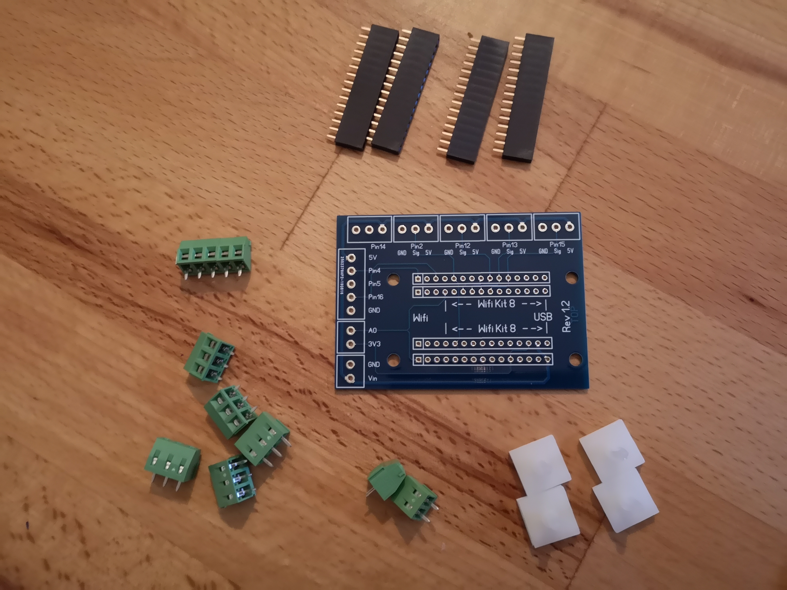
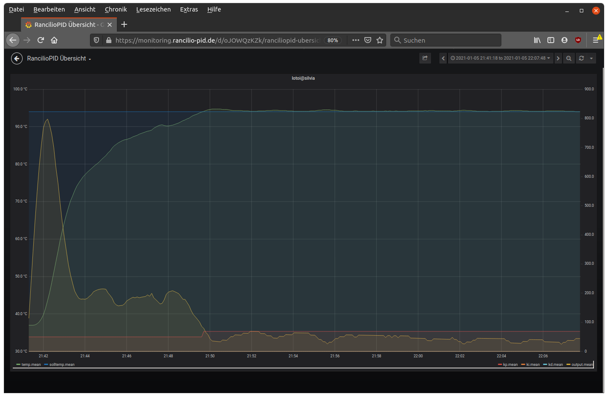

# Bestellliste
{: .no_toc }

Inhaltsverzeichnis

* TOC
{:toc}

## Warnhinweis

> {{ site.warnhinweis }}

## Die Liste

Du benötigst folgende Dinge:
(Einige davon sind sicher auch schon zu Hause in der Bastelkiste vorhanden)

### Basics

Die Basics werden auf jeden Fall benötigt und liegen (in der Regel) nicht irgendwo in der Werkstatt rum. In Klammern steht die Mindestanzahl.
Der zu verwendende Controller (ESP8266 oder ESP32) richtet sich nach der von euch bestellen Platine.

Beschreibung | ID | Anzahl PID Only | Anzahl Vollausbau | Link
-|-|-|-|-
Temperatur Sensor|TSIC 306 TO92|2 (1)|2 (1)|[Reichelt-Link](https://www.reichelt.de/tsic-digitale-halbleiter-temperatursensoren-tsic-306-to92-p82327.html?r=1), [Alternativer Shop](https://shop.bb-sensors.com/Messtechnik-je-Branche/Gebaeudetechnik/Digitaler-TSic-306-Temperatursensor-TO92.html), [Alternativer Sensor](https://www.reichelt.de/de/de/tsic-digitale-halbleiter-temperatursensoren-tsic-206-to92-p82326.html?trstct=pos_1&nbc=1&&r=1)
Schaltnetzteil|APV-8-5|1|1|[Reichelt-Link](https://www.reichelt.de/led-trafo-7-w-5-v-dc-1400-ma-mw-apv-8-5-p170873.html?&trstct=pos_0&nbc=1) oder [Amazon-Link](https://www.amazon.de/gp/product/B06Y29GSHH/)
SSR Relais – Heizung|RA 2425-D06|1|1|[Reichelt-Link](https://www.reichelt.de/solid-state-relais-ust-2-32vdc-ulast-24-280v-ra-2425-d06-p22691.html?&trstct=pos_0)
Mikrocontroller|NodeMCU V2 ESP8266 ODER ESP32 (je nach Platine)|1|1|ESP8266: [Amazon-Link](https://www.amazon.de/AZDelivery-NodeMCU-ESP8266-ESP-12E-Development/dp/B06Y1LZLLY/ref=sr_1_1_sspa?ie=UTF8&qid=1538918768&sr=8-1-spons&keywords=nodemcu+esp8266&psc=1) oder [Ebay-Link](https://www.ebay.de/itm/NodeMCU-v3-2-ESP8266-Dev-Kit-WIFI-Lolin-Amica-CP2102-v2-Arduino-IOT/252712258856?hash=item3ad6d30d28:g:TtsAAOSwlkpb3ZkV) oder [unverlötet (Amazon)](https://www.amazon.de/-/en/AZDelivery-NodeMCU-Amica-Unsoldered-Parent/dp/B07GYW4T5F/ref=sr_1_3?dchild=1&keywords=nodemcu+v2&qid=1617445906&sr=8-3) ODER ESP 32 V4:[ESP32 Dev Kit C V4](https://www.amazon.de/-/en/AZDelivery-Development-Compatible-Including-Successor/dp/B07Z83MF5W/ref=sr_1_3?keywords=azdelivery%2Besp32%2Bdevkitc%2Bv4&qid=1676019808&sprefix=esp32%2Bazdelivery%2Caps%2C82&sr=8-3&th=1)
Display (optional aber empfehlenswert)|128 x 64 Pixel OLED SSD1306 |1|1|[Amazon-Link](https://www.amazon.de/AZDelivery-Display-Arduino-Raspberry-gratis/dp/B01L9GC470/ref=sr_1_3?ie=UTF8&qid=1544291613&sr=8-3&keywords=oled+128x64)
unsere erstellte Platine|PCB|1|1|siehe unten

### Kabel

#### Hitzebeständige Kabel

Im folgenden die empfohlenen, hitzebeständigen Kabel.

Beschreibung | ID | Anzahl PID Only | Anzahl Vollausbau | Link
-|-|-|-|-
Hochtemperaturader ÖLFLEX® HEAT 180 SIF 1 x 1.50 mm², schwarz|601382|2|2|[Link](https://www.conrad.de/de/p/lapp-0051001-hochtemperaturader-oelflex-heat-180-sif-1-x-1-50-mm-schwarz-meterware-601382.html)
Hochtemperaturader ÖLFLEX® HEAT 180 SIF 1 x 1.50 mm², blau|600368|2|2|[Link](https://www.conrad.de/de/p/lapp-0051002-hochtemperaturader-oelflex-heat-180-sif-1-x-1-50-mm-blau-meterware-600368.html)
Hochtemperaturader ÖLFLEX® HEAT 180 SIF 1 x 0.25 mm², schwarz|604025|2|2|[Link](https://www.conrad.de/de/p/lapp-0047001-hochtemperaturader-oelflex-heat-180-sif-1-x-0-25-mm-schwarz-meterware-604025.html)
Hochtemperaturader ÖLFLEX® HEAT 180 SIF 1 x 0.25 mm², rot|603963|2|2|[Link](https://www.conrad.de/de/p/lapp-0047104-hochtemperaturader-oelflex-heat-180-sif-1-x-0-25-mm-rot-meterware-603963.html)
Hochtemperaturader ÖLFLEX® HEAT 180 SIF 1 x 0.25 mm², grün|609459|2|2|[Link](https://www.conrad.de/de/p/lapp-0047006-hochtemperaturader-oelflex-heat-180-sif-1-x-0-25-mm-gruen-meterware-609459.html)
Hochtemperaturader ÖLFLEX® HEAT 180 SIF 1 x 0.25 mm², gelb|602330|2|2|[Link](https://www.conrad.de/de/p/lapp-0047005-hochtemperaturader-oelflex-heat-180-sif-1-x-0-25-mm-gelb-meterware-602330.html)

#### Normale Kabel

Im folgenden die normalen Kabel. Diese werden nicht empfohlen, sind aber bei entsprechender Führung auch einsetzbar.

Beschreibung | ID | Anzahl PID Only | Anzahl Vollausbau | Link
-|-|-|-|-
Schaltlitze H07V-K, 1,5 mm, 10 m, blau|H07VK 1,5-10BL|1|1|[Link](https://www.reichelt.de/schaltlitze-h07v-k-1-5-mm-10-m-blau-h07vk-1-5-10bl-p69504.html?)
Schaltlitze H07V-K, 1,5 mm, 10 m, schwarz|H07VK 1,5-10SW|1|1|[Link](https://www.reichelt.de/schaltlitze-h07v-k-1-5-mm-10-m-schwarz-h07vk-1-5-10sw-p69503.html?)
Kupferlitze isoliert, 10M, 1×0,14mm², schwarz|LITZE SW|1|1|[Link](https://www.reichelt.de/kupferlitze-isoliert-10-m-1-x-0-14-mm-schwarz-litze-sw-p10298.html?)
Kupferlitze isoliert, 10M, 1×0,14mm², blau|LITZE BL|1|1|[Link](https://www.reichelt.de/kupferlitze-isoliert-10-m-1-x-0-14-mm-blau-litze-bl-p10292.html?)
Kupferlitze isoliert, 10M, 1×0,14mm², rot|LITZE RT|1|1|[Link](https://www.reichelt.de/kupferlitze-isoliert-10-m-1-x-0-14-mm-rot-litze-rt-p10297.html?)
Kupferlitze isoliert, 10M, 1×0,14mm², grün|LITZE GN|1|1|[Link](https://www.reichelt.de/kupferlitze-isoliert-10-m-1-x-0-14-mm-gruen-litze-gn-p10296.html?)

### Zubehör

Das Zubehör wird auf jeden Fall empfohlen. In einer gut sortierten Werkstatt findet man ggf. das ein oder andere bereits.

Beschreibung | ID | Anzahl PID Only | Anzahl Vollausbau | Link
-|-|-|-|-
Flachsteckhülsen mit Schrumpfschlauch – 1,5 … 2,5 mm², blau|WE F602638HS|10|20|[Reichelt-Link](https://www.reichelt.de/flachsteckhuelsen-mit-schrumpfschlauch-1-5-2-5-mm-blau-we-f602638hs-p189402.html?&trstct=pos_0&nbc=1)
Flachsteckhülsen mit Abzweig – 1,5 … 2,5 mm², transp., vollisoli|WE F606638.1N|5|5|[Reichelt-Link](https://www.reichelt.de/flachsteckhuelsen-mit-abzweig-1-5-2-5-mm-transp-vollisoli-we-f606638-1n-p189372.html?search=WE+F606638.1N)
Flachstecker mit Schrumpfschlauch – 1,5 … 2,5 mm², blau|WE F616638HS|10|20|[Reichelt-Link](https://www.reichelt.de/flachstecker-mit-schrumpfschlauch-1-5-2-5-mm-blau-we-f616638hs-p189408.html?&trstct=pos_0&nbc=1)
Ring-Kerbschuhe, für M3, rot|RK-R-3|10|10|[Reichelt-Link](https://www.reichelt.de/ring-kerbschuhe-fuer-m3-rot-rk-r-3-p15259.html?&nbc=1)
Ring-Kerbschuhe, für M5, rot|RK-R-5|10|10|[Reichelt-Link](https://www.reichelt.de/ring-kerbschuhe-fuer-m5-rot-rk-r-5-p142770.html?&nbc=1)
Relais für **Vollausbau** (siehe unten)|DEBO RELAY 4WAY|0|1|[Reichelt-Link](https://www.reichelt.de/entwicklerboards-4-wege-solid-relais-5v-240v-2a-debo-relay-4way-p280064.html?)
Schrumpfschlauch|DELOCK 86271|1|1|[Link](https://www.reichelt.de/schrumpfschlauch-sortiment-schwarz-100-teilig-delock-86271-p152924.html?&trstct=pol_0&nbc=1)
Schraube M4x16||1|1|
Mutter M4||2|2|
Unterlegscheibe M4||2|2|
Wärmeleitkleber (nichtleitend) für den Sensor|Silverbead Wärmeleitkleber|||[Link](https://www.amazon.de/Silverbead-W%C3%A4rmeleitkleber-10-Gramm-SG100X/dp/B019MNSABG/ref=sr_1_1?ie=UTF8&qid=1538938085&sr=8-1&keywords=w%C3%A4rmeleitkleber)
alternativ||||
Wärmeleitpaste für den Sensor|ARCTIC MX-4-2|||[Link](https://www.reichelt.de/arctic-mx-4-waermeleitpaste-2g-arctic-mx-4-2-p261247.html?&trstct=pos_14&nbc=1)
Jumperkabel (optional)| AZDelivery Jumper Wire Kabel 3 x 40 STK | 1 | 1 | [Amazon-Link](https://www.amazon.de/Jumper-Wire-Set-M2M-Parent/dp/B07ZP4JLMM)
alternativ | siehe unten
Dupont-Stecker (optional) | Dupont Stecker | 1 | 1 | [Reichelt-Link](https://www.reichelt.de/de/de/entwicklerboards-dupont-crimp-set-610-teilig-debo-set-dupont-p279901.html?trstct=pos_0&nbc=1&&r=1) oder [Amazon-Link](https://www.amazon.de/BESTOMZ-Stecker-m%C3%A4nnlich-weiblich-Anschluss/dp/B073SSV9TL/)
Crimpzange|KN 97 22 240|||[Link](https://www.reichelt.de/crimpzange-240-mm-isolierte-kabelschuhe-kabelverbinder-kn-97-22-240-p122639.html?&trstct=pos_0&nbc=1)
Lötkolben|ERSATZKOLBEN EP5|||[Reichelt-Link](https://www.reichelt.de/loetkolben-ep-5-ersatzkolben-ep5-p58217.html?&trstct=pos_0&nbc=1)

## Anmerkungen zur Bestelliste

### ESP32 Platine
Es steht ab sofort die neue ESP32 Platine zur Verfügung. 
[Bitte direkt über unseren Chat anfragen!](https://discord.com/invite/Kq5RFznuU4) **Bitte direkt per PN an @loque wenden**
**Stand 7.12.23: Momentan sind keine ESP32 Platinen verfügbar. Vorraussichtlich ab Januar wieder bestellbar**

Inklusive sind:
 * Das PCB
 * Die Schraubklemmenblöcke
 * Die Stiftleisten
 * Klebepads

**ZUSÄTZLICH** werden folgende Dinge benötigt:

Bauteil | Beschreibung | Link
-|-|-
C1 |220µF (Elko) | [Link](https://www.reichelt.de/elko-radial-220-uf-10-v-105-c-low-esr-fm-a-220u-10-p200036.html?&trstct=pol_0&nbc=1)
C2 |100nF (Keramik) | [Link](https://www.reichelt.de/vielschicht-kerko-100-nf-50-v-rm-5-125-c-hita-sf1h104z-l5-p246835.html?&trstct=pos_9&nbc=1)
R1 |4,7kΩ (Display) | [Link](https://www.reichelt.de/widerstand-metallschicht-4-7-kohm-0204-0-4-w-1--yag-4fte52-4k7-p236963.html?&trstct=pol_0&nbc=1)
R2 |4,7kΩ (Display) |[Link](https://www.reichelt.de/widerstand-metallschicht-4-7-kohm-0204-0-4-w-1--yag-4fte52-4k7-p236963.html?&trstct=pol_0&nbc=1)
R3 |47kΩ (Brew switch) | [Link](https://www.reichelt.de/widerstand-metallschicht-47-kohm-axial-0-4-w-1--vis-c4702fc100-p237115.html?&trstct=pol_0&nbc=1)
R4 |47kΩ (Power switch) |[Link](https://www.reichelt.de/widerstand-metallschicht-47-kohm-axial-0-4-w-1--vis-c4702fc100-p237115.html?&trstct=pol_0&nbc=1)
R5 |47kΩ (Steam switch) |[Link](https://www.reichelt.de/widerstand-metallschicht-47-kohm-axial-0-4-w-1--vis-c4702fc100-p237115.html?&trstct=pol_0&nbc=1)
R6 | Nach Bedarf | Widerstand entsprechend der gewählten LED nehmen, bei Nutzung von z.B. Neopixel braucht es keinen Widerstand, dafür Lötjumper JP1 schließen 

Beim Löten des Elkos auf die Polarität achten!

**Bugs ESP32_mininmal PCB Rev 1.2:**

Fehler in der Beschriftung:

* S_LED: statt VCC muss hier 5V stehen
* E_TRIG: statt VCC muss hier 5V stehen
* W_SENS: statt IO36 muss hier IO23 stehen
* GPIO Header:  statt IO23 muss hier IO36 stehen 

Fehler Optokoppler für Brüherkennung:

* Nur mit High Level Trigger Optokoppler kompatibel
* Workaround für Low Level Trigger: Pulldown Widerstand R3 nicht einlöten und "PINMODEVOLTAGESENSOR" auf "INPUT_PULLUP" setzen 

**Bugs EPS32_minimal PCB Rev 1.3:**

Fehler Optokoppler für Brüherkennung:

* Nur mit High Level Trigger Optokoppler kompatibel
* Workaround für Low Level Trigger: Pulldown Widerstand R3 nicht einlöten und "PINMODEVOLTAGESENSOR" auf "INPUT_PULLUP" setzen 

### ESP8266 Platine

[Bitte direkt über unseren Chat anfragen!](https://discord.com/invite/Kq5RFznuU4) **Bitte direkt per PN an @loque wenden**

Inklusive sind:
 * Das PCB
 * Die Schraubklemmenblöcke
 * Die Stiftleisten
 * Klebepads

### Infos zum Wärmeleitkleber
Wärmeleitkleber/-paste ist umstritten (siehe [Link](https://www.igorslab.de/mythos-waermeleitpaste-edelpaste-zum-apothekenpreis-gegen-guenstiges-massenprodukt-wir-rechnen-gnadenlos-nach/) und Block unten zur Herleitung). Nichtsdestotrotz befestigen einige Anwender den TSIC mit dem Kleber direkt am Kessel. Zusammenfassend kann man sagen: Tragt möglichst wenig davon auf. Alternativ zum Kleben befestigt ihr den Sensor besser mit der nun leeren Halterung des Thermostats (und einer zusätzlichen Schraube und Mutter). Damit sollte sich ein akzeptables Maß aus Temperaturdifferenz und sicherer Befestigung erreichen lassen.

  
 Diskussion zum Wärmeleitkleber 

  Wie oben bereits erwähnt ist Wärmeleitkleber wegen seiner schwachen Wärmeleitfähigkeit umstritten. Einer der wenigen _empfehlenswerten_ Wärmeleitkleber ist von Arctic Silver mit einer Wärmeleitfähigkeit von 4 W/mK im vernetzten Zustand: [Link](https://www.webshop-innovatek.de/waermeleitmittel/waermeleitkleber/368/arctic-silver-waermeleitkleber-2x-4-g-neue-version) (leider nur schwer bzw. zu Apothekenpreisen erhältlich). Der oben verlinkte Kleber verfügt hingegen nur über eine Wärmeleitfähigkeit von etwa 1 W/mK (unter der Annahme, dass die Angaben korrekt sind).

  Als Bsp. für die Paste würde eine Schichtdicke von 0,05 mm einen Wärmeleitwiderstand von 0,29 K/W ergeben. Bei 0,5 mm sind wir schon bei 2,9 K/W.

  Das bedeutet das bei einer Verlustleistung von 1 W die Temperaturdifferenz zwischen Quelle (Boiler) und Senke (Sensor) bei 0,29 bzw. 2,9 K liegt.

  Aus diesem Grund ist es sehr wichtig, das die Paste oder zur Not der Kleber so **DÜNN WIE MÖGLICH** aufgetragen wird! Wir reden hier im Optimalfall von 0,04 mm.

### Infos zum Temperatursensor
Wir geben hier den Tipp gleich mindestens 2 TSIC Sensoren zu kaufen. Wir haben es nun häufiger erleben müssen, dass die Sensoren falsch verdrahtet werden oder diese anderweitig beschädigt sind. Daher denkt einfach gleich an eine Reserve bei der Bestellung bei Reichelt. Bitte einen falsch verpolten Sensor nicht mehr verwenden, dieser geht kurzfristig kaputt oder zeigt unrealistische Werte an (für Details siehe [Temperatursensor anschließen](./hardware/hardware.md#temperatursensor-anschließen)).

### Infos zum Microcontroller
Man kann beim NodeMCU **nicht** die V1 oder V3 nehmen. Nur die V2 passt auf das PCB. In Kürze werden neuere Versionen der Software nur noch mit ESP32 kompatibel sein, hier muss es das DevKitC V4 sein (mit ESP32, nicht ESP32S oder C etc.)

### Infos zu den Steckern
Es sind jeweils mehr Stecker als benötigt angegeben. Es ist empfehlenswert hier eher mehr zu Bestellen, da gerne mal etwas schief läuft und man sonst ohne Kaffee auf die neue Bestellung warten muss.

### Infos zum Netzteil
Das Netzteil hat bei wenigen Personen zu Problemen geführt (Reboots).
Insbesondere bei den neueren Rancilio Silvia E Varianten oder kleineren Maschinen ist auch der Platz ein Thema. Eine Alternative kann in beiden Fällen ein einfaches USB Netzteil sein, für welches aber eine ordentliche Kontaktierung schwierig ist.

### Infos zum Display und Jumper (bzw. Dupont)
Das Display wird für keine Ausbaustufe zwangsläufig benötigt. Ohne Display lässt es sich jedoch kaum vermeiden, dass man bei jedem Bezug am Smartphone die Temperatur prüfen muss. Im regulären Lauf sieht die Anzeige nämlich wie folgt aus (es wird in kurzen Intervallen geheizt um die Temperatur zu halten):

Regulärer Lauf | Auszug Monitoring (Grafana)
:---:|:---:
|

Wer es einfach mag, kann das Display entweder neben die Maschine legen, oder an einem der Bleche fixieren. Wie ihr einzelnen Bauberichten entnehmen könnt ([Link](https://clevercoffee.de/rancilio-silvia-e-konstantin/)), kann das Display natürlich auch sauber hinter einem der Bleche integriert oder mit einem 3D-gedruckten Gehäuse an der Maschine befestigt werden.

Für einen ersten Betrieb des Displays empfehlen sich die gelisteten Jumperkabel - so muss nicht zwangsläufig gelötet werden. Jumper sind gut für den Trockenaufbau geeignet, haben aber keinen ausreichend stabilen Halt an den Pins für den dauerhaften Einbau.
Alternativ könnt ihr euch ein Dupont-Set mit Crimpzange zulegen. Dieses hat den Vorteil, dass ihr die Länge der Verbindung frei zuschneiden könnt. Es kann aber nur mit einer Crimpzange genutzt werden kann. Dupont-Stecker sind gut für den finalen Einbau geeignet und man muss ebenfalls nicht am Display löten.
Beachtet jedoch den entsprechenden Hinweis zum Temperatursensor (dieser sollte gelötet werden): [Link](./hardware/hardware.md/#tipps-und-tricks).

### Infos zum Vollausbau SSR
Wir haben im Projekt viele diverse Relais für die Pumpe und das Ventil testen „dürfen“ – diese sind leider nicht so stabil wie die der SSR für die Heizung. Folgende Erkenntnisse haben wir dabei gesammelt:

#### Beste Lösung: High Trigger SSR
User im Chat haben zuverlässige Bezugsquellen für High Trigger gefunden: [Link](https://www.roboter-bausatz.de/1450/2-kanal-solid-state-relais-modul-5v/230vac-high-level-trigger). Daher ist dies momentan unsere Favorit.

Alternativ kann bei Reichelt auch folgender High Trigger mitbestellt werden: [Link](https://www.reichelt.de/entwicklerboards-4-wege-solid-relais-5v-240v-2a-debo-relay-4way-p280064.html?&trstct=pos_0&nbc=1).

Bei einigen SSR-Ralais, z.B. dem von Reichelt muss ggf. noch ein Widerstand parallel zu der Pumpe geschaltet werden. Hintergrund hierzu ist, dass die SSRs in der Regel nur bei einem Nulldurchgang der Spannungskennlinie schalten. Die Vibrationspumpe in den Espressomaschinen funktioniert jedoch durch eine interne Diode die nur eine Halbwelle durchlässt. Dementsprechend kommt es nie zu einem Nulldurchgang. Einige Relais funktionieren trotzdem. Um diesem Problem Abhilfe zu schaffen wird ein Widerstand parallel zu der Pumpe geschaltet. Aus Erfahrung funktionieren 200k und 100k Widerstände. Wobei ein 100k Widerstand an dieser Stelle sinnvoller ist. Zu beachten ist hier die Leistung die über dem Widerstand abfällt. Die normalen "Wald und Wiesen" Widerstände die in Sortimentskästen verkauft werden haben nur 1/4 Watt was bei 200k recht grenzwertig und bei 100k unzureichend ist. Auf der sicheren Seite ist man mit einem 100k Widerstand mit 1W. Wie z.B. [Link](https://www.reichelt.de/widerstand-metalloxyd-100-kohm-0207-1-0-w-5--1w-100k-p1778.html?&trstct=pos_1&nbc=1) 

#### Schlechteste Lösung: Spulen Relais
Ja, Spulen Relais kann man verwenden, dabei können durch die Bauweise der Relais Probleme entstehen, die sich nicht immer lösen oder reproduzieren lassen: [Link](https://www.amazon.de/AZDelivery-2-Relais-Optokoppler-Low-Level-Trigger-Arduino/dp/B078Q326KT/ref=sr_1_7_sspa?__mk_de_DE=%C3%85M%C3%85%C5%BD%C3%95%C3%91&dchild=1&keywords=azdelivery%2Bspulen%2Brelais&qid=1603614378&sr=8-7-spons&spLa=ZW5jcnlwdGVkUXVhbGlmaWVyPUExNDdFUE9JRkxXSkNEJmVuY3J5cHRlZElkPUEwNDU5MDU1OVlVSENDWEZNQTQzJmVuY3J5cHRlZEFkSWQ9QTAwNDA1MTEzUlBCUzUwVFdZSTI3JndpZGdldE5hbWU9c3BfbXRmJmFjdGlvbj1jbGlja1JlZGlyZWN0JmRvTm90TG9nQ2xpY2s9dHJ1ZQ&th=1). Lösungen mit einer galvanischen Trennung können manchmal helfen [Link](https://www.kollino.de/arduino/4-8-kanal-relais-anleitung/). Daher ist es die schlechteste Lösung bei den Relais.

#### SSR-Board von Amazon
Manche gehen ins Spielcasino, wir bestellen bei Amazon – Manchmal hat man Pech und wo „High Trigger“ drauf steht, ist doch „Low Trigger“ drin. Einen Low Trigger erkennt ihr an einem „2TY“ auf dem einen Baustein des SSR-Boards. „J3Y“ ist hierbei der besser geeignete HIGH Trigger. SSR Boards sind besser als die Spulen-Relais, aber Low Trigger können auch Probleme verursachen.

#### Alternative: 2x Heizungs-SSR
Wenn der Platz vorhanden ist, könnte man auch 2x den Heizung SSR nutzen.
