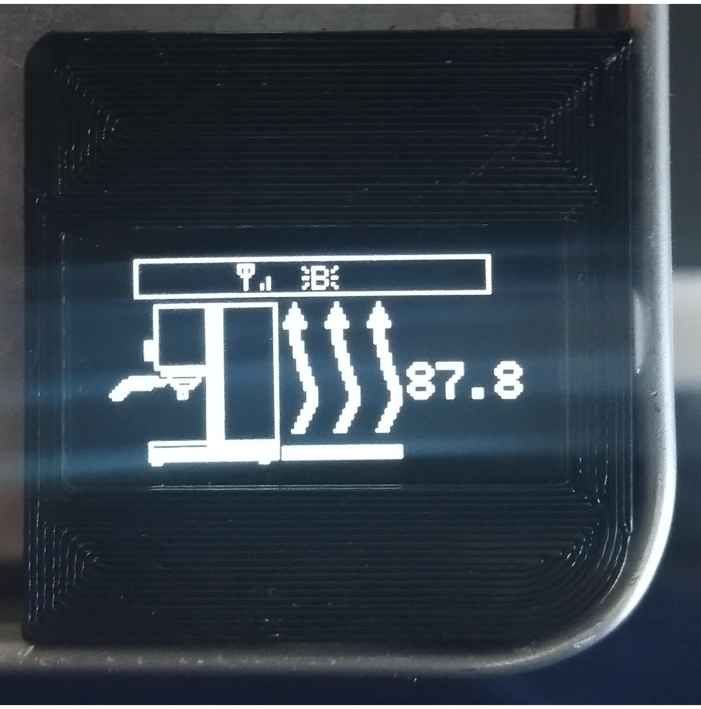
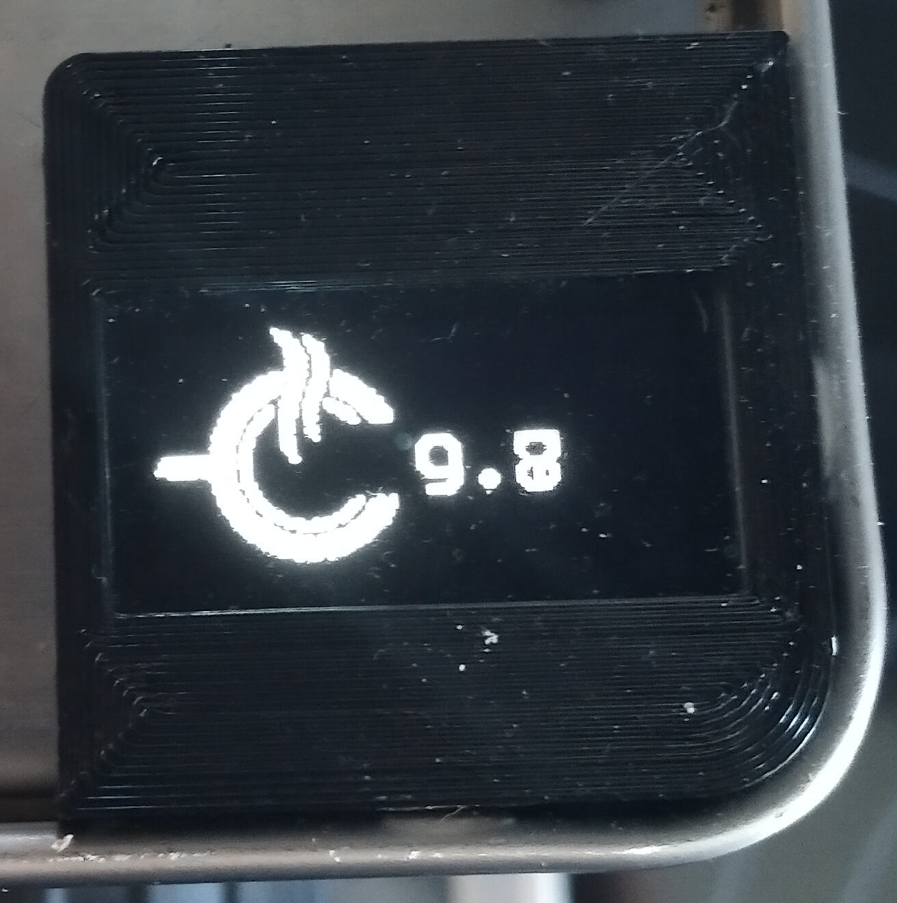
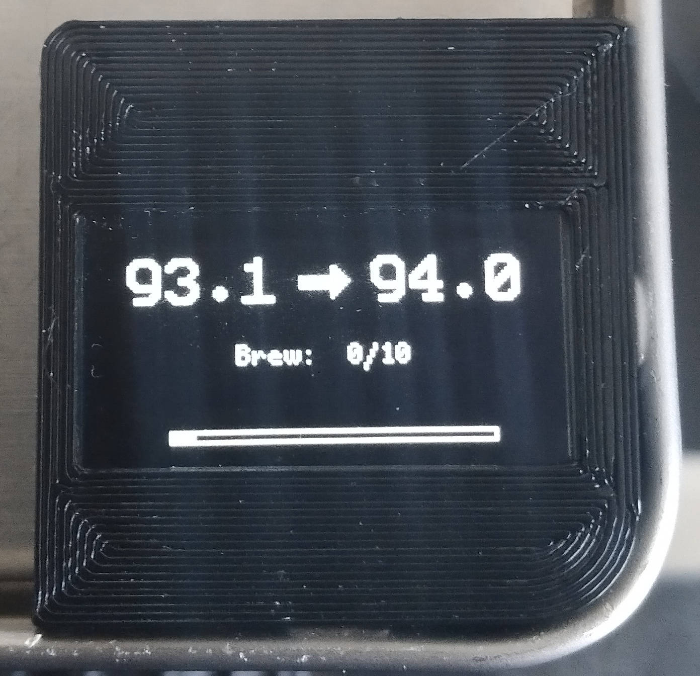

# Display
{: .no_toc }

Inhaltsverzeichnis

* TOC
{:toc}

## Einleitung
Es stehen dir mehrere Designs für dein Display zur Verfügung.
Diese können in der Userconfig ausgewählt werden:

> #define DISPLAYTEMPLATE 3          // 1 = Standard Display Template, 2 = Minimal Template, 3 = only Temperatur, 20 = vertical Display see git Handbook for further information

## Unabhängige Anzeigen
Es gibt Anzeigen, die unabhänbgig vom Displaytemplate angezeigt werden:

### Kaltstart:

Dies zeigt an, dass sich die Maschine noch im Kaltstart befindet. Inkl. der aktuellen Temperatur.

### Brewtimer:

Der Brewtimer (oder Shottimer) wird ebenfalls in der Userconfig ausgewählt:

> #define SHOTTIMER 1                // 0 = deactivated, 1 = activated

Je nach Setup (PID Only vs. Vollausbau) wird der Brewtimer angezeigt, sobald ein Bezug festgestellt wird (hard- bzw. softwareseitig).
Bei OnlyPID sind standardmaüßig 35 Sekunden hinterlegt. 

## Standard Design - DISPLAYTEMPLATE 1

Erläuterung zur Anzeige:
Oben sind von (links) folgende Symbole zu sehen:
* Wlan (Durchgestrichen wenn kein Empfang)
* Blynk (Durchgestrichen wenn kein Blynk vorhanden)
* MQTT (Wenn MQTT aktiviert ist)
* Offline (wenn kein Wlan vorhanden ist)

Links zeigt dir das Thermometer mit einem Blinken, wenn die Solltemperatur erreicht ist.
Die mittige Anzeige (von oben)
* IST: Ist-Temperatur
* Soll: Soll-Temperatur
* Brew: Bei einem Bezug wird softwareseitig oder hardwareseitig angezeigt, welche Zeit beim Bezug verstrichen ist
* P | I | D : Anzeige der aktuellen PID Werte, die aktuell gültig sind. Kann sich je nach Phase ( Kaltstart, Brühvorgang oder Normalbetrieb) ändern

## Minimal Design - DISPLAYTEMPLATE 2

Erläuterung der Anzeige:
Links wird die Ist-Temperatur angezeigt. Rechts die Solltemperatur. Ist diese erreicht, beginnt das Display zu blinken.

In der Mitte befindet sich die Brühanzeige. Der Balken zeigt den Brühfortschritt an. Wer diese Funktionen sinnvoll nutzen möchte, muss den Brewtimer deaktivieren (siehe oben). 
