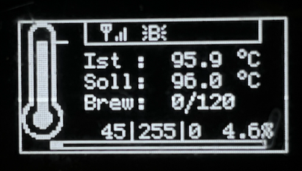

# Display
{: .no_toc }

Inhaltsverzeichnis

* TOC
{:toc}

## Einleitung
Es stehen dir aktuell 2 Designs für dein Display zur Verfügung.
Diese können in der Userconfig mit ausgewählt werden
#define DISPLAYTEMPLATE 1    // 1: Standard Display Template, 2: Minimal Template, 

## Standard Design - DISPLAYTEMPLATE 1 

## Minimal Design - DISPLAYTEMPLATE 2

 
