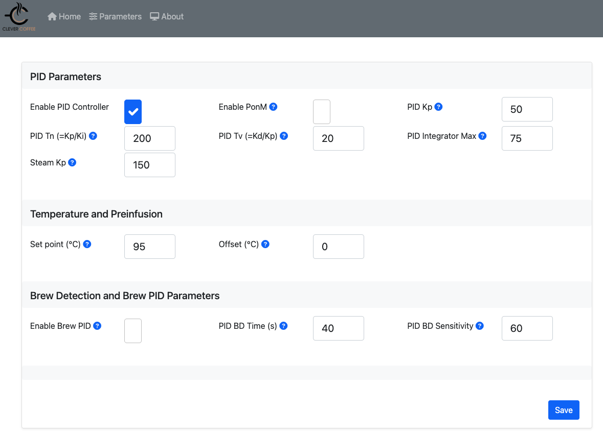
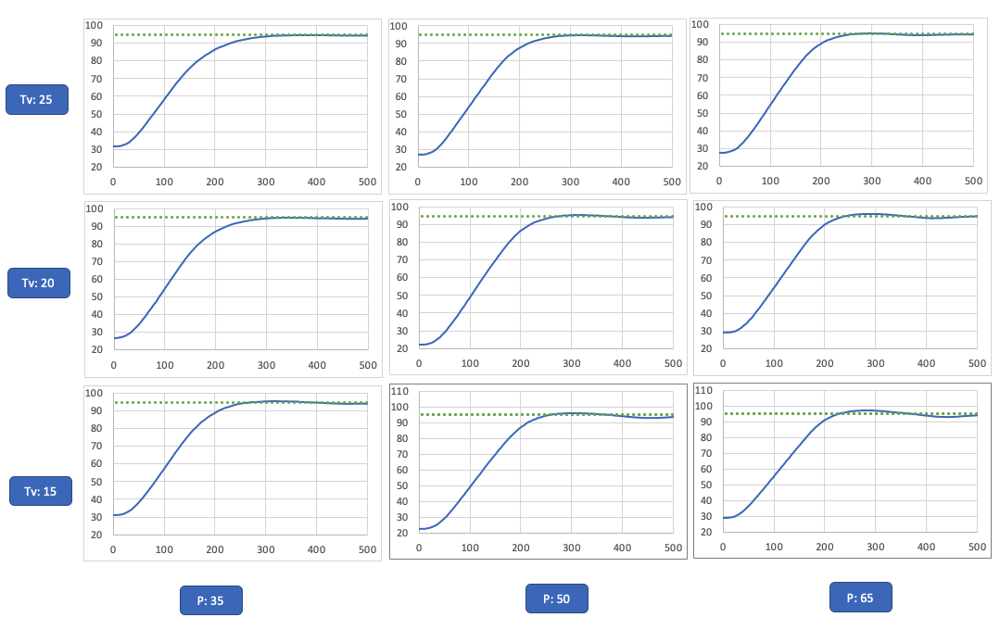
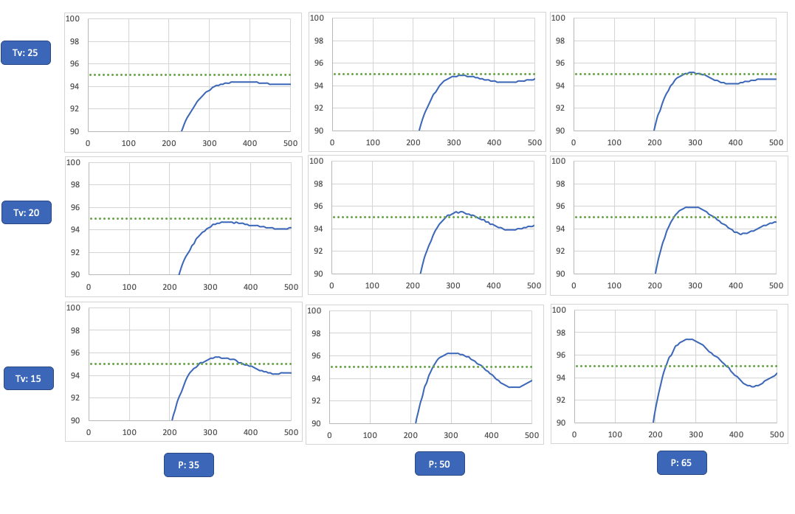
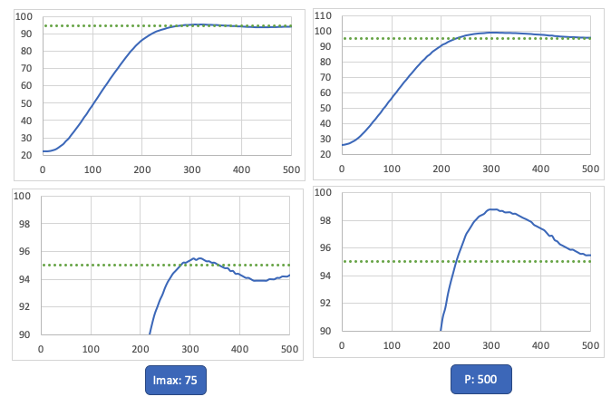
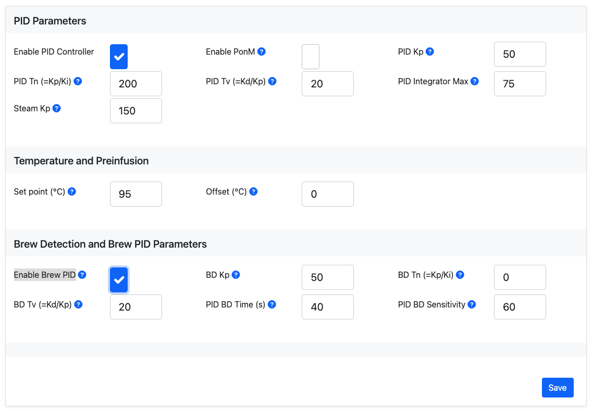

# PID-Werte
{: .no_toc }

Inhaltsverzeichnis

* TOC
{:toc}

## Einleitung

Der PID-Regler soll die folgenden Betriebszustände korrekt handhaben:

 

Bereiche | Erklärung
:--|:--
1 | Kaltstart
2 | Regulärer Betrieb (Temperatur halten)
3 | Brüherkennung (BD)

Ab Release 3.1.0 wurde der PID-Regler nochmals deutlich vereinfacht und verbessert. Die bisherige Brüherkennung (wer sie noch kennen sollte) ist nun faktisch nur noch in seltenen Fällen notwendig, auch separate Parameter für den Kaltstart der Maschine sind nicht mehr notwendig.
Beide Modi sind aber optional weiterhin aktivierbar.

Die zugehörigen Werte lassen sich im Webinterface auf der Seite "Parameters" einstellen:

 

Parameter | Erklärung
:--|:--
Enable PID Controller | muss beim ersten Start aktiviert werden, schaltet den PID-Regler an/aus
Enable PonM | Alternativer PID-Modus, war für den alten Kaltstart relevant, Standardmäßig "aus"
PID Kp | Proportional-Anteil des PID
PID Tn (=Kp/Ki)| Integral-Anteil vom PID
PID Tv (=Kd/Kp) | Differenzial-Anteil vom PID
PID Integrator Max | Begrenzt den Integrator des I-Anteil, wichtig für das Halten der Temperatur.
Steam Kp | P-Anteil für den Dampfmodus
Set point (°C) | Soll-Temperatur des Kessels
Offset (°C) | Wird zur gemessenen Temperatur addiert, so dass z.B. der Temperaturverlust auf dem Weg vom Kessel zur Brühgruppe ausgegelichen werden kann. Standard: 0
Enable Brew PID | Aktivieren um andere PID-Werte während des Brühens zu setzen, optional, im Normalfall nicht empfohlen
PID BD Time (s)| Maximale Bezugszeit des Brühzeitzählers (bei "PID Only" ohne Optokoppler, dann gibt es kein Maximum) 
PID BD Sensitivity | Empfindlichkeit der PID Brew Detection im Bezug auf Abfall der Temperatur (0 = aus, kleinere Werte: hohe Empfindlichkeit, höhere Werte: geringere Empfindlichkeit der Erkennung)

## Standardwerte für diverse Maschinentypen

### Rancilio Siliva

Parameter | Rancilio Siliva V1-2 | Rancilio Siliva V3-V6 | Rancilio Silvia seitlicher Sensor
:--|:--|:--|:--
PID Kp | 62 | 50 | 55
PID Tn (=Kp/Ki) | 52 | 200 | 65
PID Tv (=Kd/Kp) | 11.5 | 20 | 13
PID Integrator Max | 75 | 75 | 75 
Steam Kp | 150 | 150 | 150
PID BD Sensitivity | 120 | 60 | 120

## Zusammenhang zwischen Parametern und Reglerverhalten

Ohne hier eine vollständig Abhandlung über die Funktionsweise eines PID-Reglers zu liefern soll im Folgenden kurz und knapp der Einfluss der Reglerparameter beschrieben werden:

Der Proportionalanteil – meist Kp abgekürzt – bestimmt die Heizleistung proportional zur Reglerabweichung (Differenz zwischen gemessenem Wert und dem festgelegten Sollwert). Bei 20 °C Abweichung und P = 20 ergibt sich ein Ausgangswert von 400 (Fehler * kP). Je nach Maschine entspricht dies z.B. ~40% Heizleistung. Ein Regler der ausschlieslich einen P-Anteil nutzt, neigt dazu den Soll-Wert nicht vollständig zu erreichen, da der Fehler in der Nähe des Sollwertes so klein ist, dass die eingeregelte Heizleistung nicht mehr ausreicht diesen zu verringern (sogenannte bleibende Regelabweichung). Wird kP dann höher eingestellt, kommt es zu einer dauerhaften Schwingung der Temperatur.

Daher kann ein Integralanteil hinzugenommen werden, der die bleibende Regelabweichung ausgleicht. Dieser integriert die Werte der Abweichung über die Zeit auf, das heißt zu den bisher summierten Werten wird jeder neue Wert ebenfalls addiert. So lange also eine Abweichung vom Sollwert besteht, wird dieser Wert immer größer und verstärkt die Heizleistung. Die Summe wird   mit mit einem Faktor multipliziert, bevor diese zur Heizungsleistung hinzugenommen wird. Dieser Faktor wird aus den Parametern Tn und kP gebildet. Je kleiner Tn, desto stärker ist der Anteil des Integrators an der Heizleistung.
Damit nun dieser Integratorwert nicht zu groß wird, kann mit dem  Parameter *PID Integrator Max* eine Obergrenze festgelegt werden. Das ist empfohlen, da so eine deutlich schnellere Reaktion auf ein Überschreiten des Sollwertes möglich ist.

Der Derivativanteil hat die Aufgabe, auf plötzliche Veränderungen der Messgröße, also der Temperatur, zu reagieren. Hierbei wird die zeitliche Veränderung / Steigung der Temperatur betrachtet. Der D-Anteil steuert negativ gegen Veränderungen der Temperatur, umso stärker, je stärker diese ansteigt. Damit kann z.B. ein ungwolltes Überschreiten der Solltemperatur (Überschwingen) reduziert werden, dass durch das stark verzögerte Messen der Veränderung der Wassertemperatur im Kessel entsteht.

Weitere Details zu dieser Parameterdarstellung (im Vergleich zum ebenfalls üblichen kP, kI, kD) können auch [hier](http://testcon.info/BspPID-Regler.html) nachgelesen werden.

### Anpassen der Parameter ###

Sollte das Verhalten der Temperatur mit den Standardparameter nicht genau genug sein, also z.B. die Temperatur nicht erreicht werden oder deutlich überschritten werden, sollten die Parameter genauer an die eigene Maschine angeasst werden.

Bei einer Optimierung von bereits grob funktionierenden Parametern sollte zunächst der normale Betriebszustand (Temperatur halten, nachdem die Maschine mehr als 15 Minuten aufgeheizt hat) angepasst werden.
Hierbei ist vor allem PID Integrator Max (und auch Kp bei stärkeren Abweichungen) für das Verhalten relevant. Der durchschnittliche Heizwert der nötig ist um den Temperaturverlust der Maschine nach Außen auszugleichen, sollte PID Integrator Max entsprechen. Für viele Maschinen befindet sich dieser Wert im Bereich von 30 und 100 (Watt).
Dieser darf aber auch nicht zu groß gewählt werden, wie sich gleich zeigen wird.

Für das Verhalten direkt nach dem Anschalten der kalten Maschine  (Kaltstart) müssen vor allem Kp und Tv angepasst werden. Falls die Solltemperatur überschritten wird, kann Kp reduziert werden und alternativ oder zusätzlich Tv erhöht werden, welcher den Anstieg der Temperatur abdämpft (Differentialanteil).

Während und nach dem Bezug spielen ebenfalls vor allem Kp und Tv eine Rolle, da dort schnell wieder aufgeheizt werden soll. Ein Überschwingen soll aber mittels ausreichend großem Tv abgedämpft werden, sobald die gemessene Temperatur ansteigt.

Kp und Tv müssen also so angepasst werden, dass ein guter Kompromiss gefunden wird für Kaltstart und Aufheizen nach einem Bezug. Da beim Kaltstart idealerweise noch etwas länger gewartet wird als bis zum Erreichen der gesetzten Kesseltemperatur, so dass auch der Rest der Maschine gut durchheizt (meist 15-30 min), können die Parameter in Hinblick auf den Kaltstart konservativer eingestellt werden. Die Solltemperatur muss nicht so schnell wie möglich erreicht werden, ein Unterschwingen ist zu bevorzugen, so dass dann kein Überschwingen nach dem Bezug auftritt.

Insofern ein kleiner Maximalwert für den Integralteil festegelegt ist, hat Tn für alle drei Situationen keinen starkern Einfluss, der Parameter kann also unverändert bleiben.

### Exemplarische Kurvenverläufe 

Folgende Messreihe zeigt euch, wie eine Veränderung von P und Tv das Kaltstartverhalten verändert:
 

Im Detail sieht es wie folgt am Setpoint aus:

 

Eine Erhöhnung von kP führt zu deutlichem Überschwingen, eine Erhöhung von Tv kann aber gegensteuern. Insgesamt liefern aber alle 9 Wertepaare bereits relativ gute Ergebnisse. Eine deutliche Veränderung zeigt hierbei der Wert PID Integrator Max. Dieser ermöglicht, dass sich der "Puffer" durch die stetige Regelabweichung beim Start stärker aufladen kann und über eine längere Zeit abbauen muss, auch wenn der Sollwert längst erreicht ist.
Wenn der Puffer zu klein gewählt wird, kann der Integrator keine stetige Regelanbweichung aufbauen, somit verhält sich dann der PID Regler faktisch wie ein P bzw. PD Regler. 

 

### Brühvorgang

Bei der Ausbaustufe "PID Only" (ohne Plus) ist die "PID BD Time (s)" und "PID BD Sensitivity" nur noch notwendig, um die Zeitanzeige im Display korrekt anzuzeigen. Diese Werte haben keinen Einfluss mehr auf den PID, solange "Enable Brew PID" deaktiviert ist. Mit Aktivierung von "Enable Brew PID", können nochmals eigene PID-Werte für den Brühvorgang gesetzt werden. Diese sind für die Dauer von "PID BD Time (s)" aktiv.
Es ist in der Regel aber nicht ratsam, während des Brühens stärker nachzuheizen, da die Maschine selbst bereits temperaturstabil durch ihr aufgeheiztes Metall ist (z.B. Rancilio Silvia, andere Maschinen evtl. abweichend). Durch zu starkes Nachheizen steigt dann die Temperatur im Sieb sogar noch an, was für den Kaffeegeschmack eher nachteilig sein kann. Bei kleineren/günstigeren Maschinen kann die Temperaturstabilität aber weniger gut sein, so dass ein sofortiges Nachheizen (Enable Brew PID) dort sinnvoll sein kann.

 

Parameter | Erklärung
:--|:--
BD Kp | Proportionalanteil bei erkanntem Bezug
BD Tn (=Kp/Ki) | Integralanteil bei erkanntem Bezug
BD Tv (=Kd/Kp) | Differentialanteil bei erkanntem Bezug
