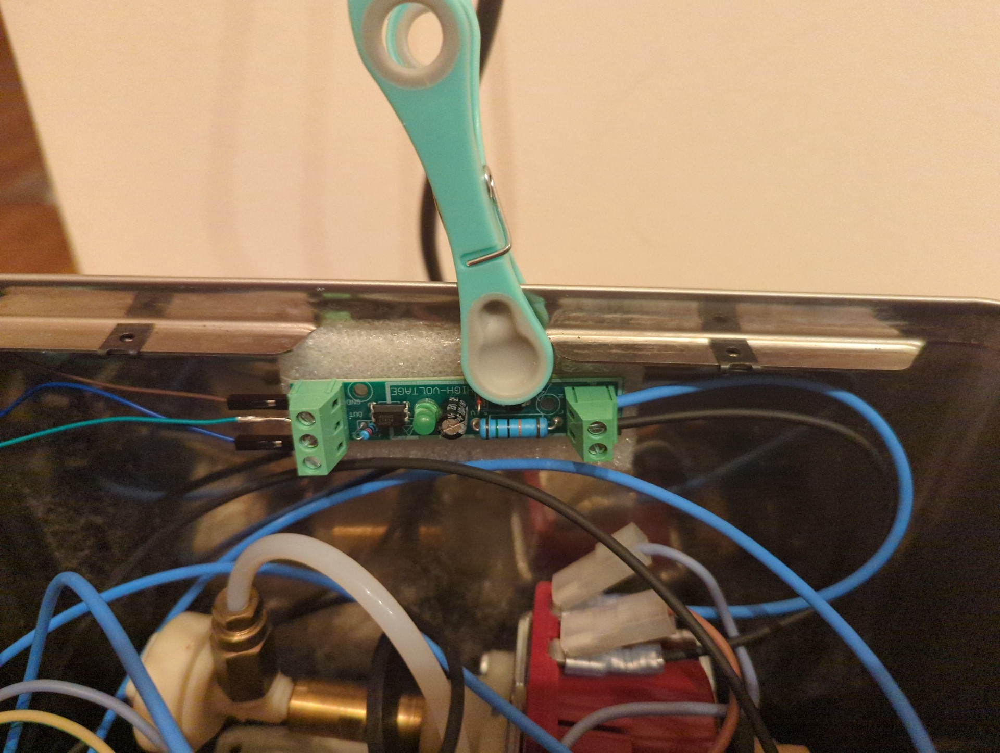
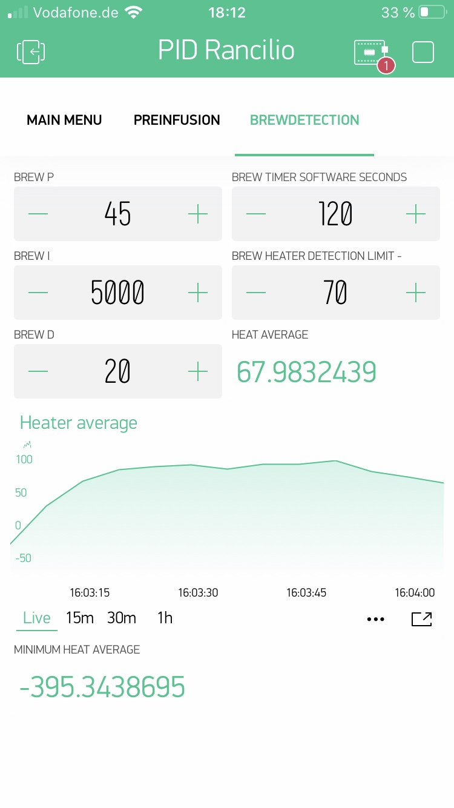

# Brüherkennung
{: .no_toc }

Inhaltsverzeichnis

* TOC
{:toc}

## Einleitung

Wie in dem vorherigen Kapitel erwähnt, soll der **brew heater detection limit** Wert auf „0“ gestellt werden, um diesen bei dem ersten Test zu deaktivieren. Wenn der normale PID gut läuft,es sich ein für dich angenehmes Heizverhalten beim Starten zeigt und die Regelung stabil am Soll-Wert läuft, dann kannst du die Brüherkennung dir genauer anschauen.

## Konfiguration der Erkennung

Die Bezugserkennung wird beim Only PID oder Vollausbau unterschiedlich realisiert. In folgender Zeile in der User Config kann diese konfiguriert werden: 
```
#define BREWDETECTION 1            
// 0 = off, 1 = Software, 2 = Hardware, 3 = Sensor/Hardware for Only PID 
```
Bei Only PID kann Auswahl 1 oder 3 (nur mit zusätzlichen Equipment, dazu später mehr) und bei der Hardwarelösung (Vollausbau) Auswahl 2 genommen werden. Beim Vollausbau wird der Brühschalter direkt an den Controller angeschlossen, daher kann der Zustand des Schalters direkt abgefragt werden.
Bei PID Only ist dem Controller dagegen nicht bekannt ob der Schalter gedrückt ist oder nicht, daher wird der Brühvorgang per Software ermittelt. Diese ist im nachfolgenden Kapitel erläutert.
### Sensor zur Brüherkennung bei Only PID
Als Ergänzung wurde eine Lösung zwischen Only PID und Vollausbau entwickelt (Only PID Plus, Auswahl 3). Hierbei wird der Brühschalter mit seiner regulären 230 Volt Verschaltung mit einem zusätzlichen Sensor überwacht, welcher dem Controller mitteilt, ob dieser betätigt wurde oder nicht. Da es unterschiedliche Sensoren gibt muss konfiguriert werden wie das Signal dem Controller übermittelt wird:
```
#define VOLTAGESENSORTYPE HIGH 
#define PINMODEVOLTAGESENSOR INPUT // Mode INPUT_PULLUP, INPUT or INPUT_PULLDOWN_16 (Only Pin 16)
#define PINVOLTAGESENSOR  15    //Input pin for voltage sensor
```
PINVOLTAGESENSOR gibt den gewählten PIN am ESP an. "VOLTAGESENSORTYPE HIGH" bedeutet, dass der Sensor ein HIGH Signal (3,3 Volt) ausgibt, wenn der Schalter gedrückt ist. "VOLTAGESENSORTYPE LOW" muss gewählt werden, wenn bei gedrücktem Schalter am Sensor ein LOW Signal (GND) ausgegeben wird. Je nach gewählten PIN und Aufbau muss ggf. ein INPUT Pullup oder Pulldown (nur Pin 16) erfolgen (PINMODEVOLTAGESENSOR INPUT oder INPUT_PULLUP oder INPUT_PULLDOWN_16). Hintergrund ist, dass durch ein Pullup oder Pulldown der PIN am ESP definiert in LOW oder HIGH gehalten wird, um dann genau das gegensätzliche Signal vom Sensor zu messen. 

Folgende Beispielkonfiguration gelten für folgende Sensoren:
1. [Wago 859-358](https://www.elektro4000.de/Steuerungen-Schaltgeraete/Relais/Schaltrelais/Schaltrelais/WAGO-GmbH-Co-KG-Relaisklemme-859-358::185163.html)

Der Sensor erhält 3,3 Volt und die andere Seite wird mit PIN 15 verbunden

```

// PID & Hardware 
[...]
#define VOLTAGESENSORTYPE HIGH 
#define PINMODEVOLTAGESENSOR INPUT // Mode INPUT_PULLUP, INPUT or INPUT_PULLDOWN_16 (Only Pin 16)
[...]
// Pin Layout
[...]
#define PINVOLTAGESENSOR  15    //Input pin for voltage sensor

```

2. [220V Sensor (Optokoppler - TTL AC 220V Isolation Modul SCM Test Board)](https://www.funduinoshop.com/epages/78096195.mobile/de_DE/?ObjectPath=/Shops/78096195/Products/B-7-2&Locale=de_DE) oder [Amazon-Link](https://www.amazon.de/DollaTek-Mikrocontroller-Optokoppler-Isolationsmodul-Testkarte/dp/B08HQ7K14H/ref=sr_1_19?__mk_de_DE=%C3%85M%C3%85%C5%BD%C3%95%C3%91&crid=1GLK3KV3YG923&keywords=optokoppler&qid=1644770841&sprefix=optokoppler%2Caps%2C106&sr=8-19)

Der Sensor erhält 3,3 Volt und die andere Seite wird mit PIN 16 verbunden


```

// PID & Hardware 
[...]
#define VOLTAGESENSORTYPE LOW 
#define PINMODEVOLTAGESENSOR INPUT // Mode INPUT_PULLUP, INPUT or INPUT_PULLDOWN_16 (Only Pin 16)
[...]
// Pin Layout
[...]
#define PINVOLTAGESENSOR  16    //Input pin for voltage sensor

```

<details markdown="block">
    <summary> Details zum Einbau </summary>

    Im Fall zwei (220V Sensor) sollte es dann wie folgt verbunden sein:

    |Board|Opto|
    |-|-|
    |GND|GND|
    |3,3V|VCC|
    |PIN 16|OUT|


</details>


## Funktionsweise

Ohne zu tief in die technischen Details der Erkennung einzusteigen soll dir dennoch kurz die grundlegende Funktionsweise erläutert werden. Der Mikrocontroller überwacht bei aktivierter Brüherkennung (BREWDETECTION 1 ) kontinuierlich die Temperatur. Dabei wird die zeitliche Veränderung der Heizrate/Kühlrate für ein fortlaufendes Zeitfenster analysiert. Das Ergebnis ist dann die „heat average“. Kühlt die Maschine ab wird dieser Wert negativ, bei einem Hochheizen entsprechend positiv.



Die Brüherkennung „horcht“ nun auf diesen „heat average“ und überprüft ob ein definierter, negativer Grenzwert überschritten wird ab dem die Maschine von einem Bezug ausgehen soll. Dieser wird bei „brew heater detection limit“ definiert. Hierbei ist zu beachten, dass hier der absolute Werte eingetragen wird: 70 entspricht -70. Die Übersetzung in den negativen Wert erfolgt im Quellcode!

Vereinfacht kann festgehalten werden, dass die „brew heater detection limit“ letztendlich die Empfindlichkeit der Erkennung wiedergibt: Je kleiner der Wert ist, je empfindlicher reagiert die Brüherkennung. Ist die Erkennung zu empfindlich eingestellt (kleiner Wert, z.B. 5), wird jedes normale Abkühlung als Brühvorgang erkannt, ist der Wert zu groß (z.B. 1000) wird die Brüherkennung erst zu spät oder gar nicht  ausgelöst. Es kann dazu hilfreich sein den Verlauf der heat average über eine längere Zeit zu beobachten und somit einen geeigneten Wert zu finden.

Wenn die Erkennung ausgelöst wird, dann gelten für den definierten Zeitraum - welcher in „brew timer Software Seconds“ (im oberen Screenshot, 120 Sekunden) definiert ist - andere PID Werte. Somit kann der Regler nun aggressiver auf den Brühvorgang reagieren und schneller hochheizen. Wichtig ist hierbei dass jede Unterschreitung des Grenzwertes zu einer Auslösung der Erkennung führt. Der Verlauf nach dem Auslösen wird nicht weiter ausgewertet, sondern die geänderten PID Werte gelten fix für die definierte Zeit nach der Erkennung des Bezuges.

## PID Werte
Die geänderten PID Werte gelten immer, wenn ein Brühvorgang erkannt wird, sei es per Software oder im Vollausbau durch die Abfrage am Brühschalter. Die Zeitdauer wird mit "brew timer Software Seconds" in der Blynksteuerung festgelegt. 
Für den kurzen Zeitraum muss der PID schnell wieder auf Temperatur kommen, ohne überzuschwingen. Hierzu muss vor allem der I-Anteil erhöht werden, damit sich der Regler nicht die erfolgte Abweichung vom Soll-Wert für die Zukunft „merkt“. Der D-Anteil kann auch erhöht werden, um den Regler beim Abfallen der Temperatur zu „beschleunigen“ und „abzubremsen“, wenn die Temperatur wieder Richtung Soll-Wert geht. Als Größenordnung können die Werte aus dem oberen Screenshot genommen werden.
In der nachfolgenden Tabelle sind bewährte PID für die Brüherkennung zu finden.

Maschine |	P |	I |	D | Timer |  Limit 
:-|-|-|-|-|-
Rancilio Silvia (nicht isoliert) | 50 | 0 | 20 | 120 | 45 
Rancilio Silvia E (isoliert) | 70 | 0 | 20 | 240 | 65 
Gaggia | 75 | 0 | 15 | 180 | 90 
Quick Mill (Modell 0835 & 3000) | 80 | 0 | 80 | 100 | tbd.


## Vergleich bei einem Bezug

Ausgangssituation sind folgende PID Parameter:


Bei dem Vergleich von einem Bezug mit und ohne Brüherkennung ist zu sehen, dass die Solltemperatur zu einem ähnlichen Zeitpunkt „durchschritten“ wird, aber ohne Erkennung die Temperatur nach oben ausschlägt (96 °C). Die Erkennung kann hier ein deutlich besseres Ergebnis liefern (ca. 93,5 °C). Auch fällt die Temperatur beim Bezug nicht so rapide nach unten ab, da die Heizung schneller reagieren kann.

In der Praxis zeigt sich bei mir zu Hause, dass zügig und reproduzierbar mehrere Espresso hintereinander gezogen werden können, da meistens die 3 Minuten ausreichen den Kaffee zu verteilen und neue Bohnen zu mahlen.
