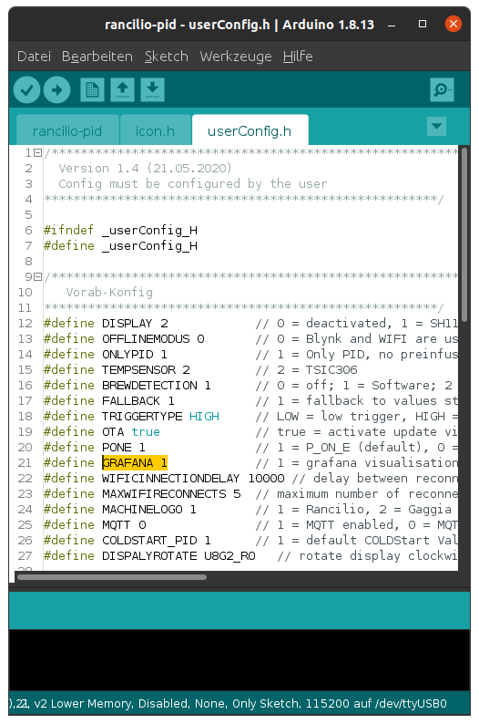

# Monitoring
{: .no_toc }

Inhaltsverzeichnis

* TOC
{:toc}

## Einleitung

Die Blynk-App kann so eingerichtet werden, dass via eines sog. Webhooks ein Monitoring genutzt werden kann. Dafür wird [Grafana](https://grafana.com/) genutzt. Damit sind auch die vorhandenen PID-Charts erstellt entstanden:


## Übersicht

Eine Übersicht über alle vorhandenen Sensoren findet er ihr hier: [Rancilio-PID Monitoring](https://monitoring.rancilio-pid.de/d/oJOWQzKZk/ranciliopid-ubersicht).

## Installations-Video

Folgendes Video erklärt die einzelnen Schritte:

[](https://www.youtube.com/watch?v=WHN45x1gY10)

## Umsetzung

### Voraussetzung

In eurer `userConfig.h` muss Grafana aktiviert sein (sprich auf `1` gesetzt):



<!-- markdown-link-check-disable -->
### Schritt für Schritt

1. Geht auf die konfigurierte Blynk App
1. Aktiviert den Änderungsmodus (über das Rechteck rechts-oben)
1. Öffnet die Widget Box (vom rechten Rand ziehen)
1. Wählt unter `Other` den `Webhook` aus
1. Öffnet das neu erschienene Widget `Webhook`
1. Wählt den virtuellen Pin `V60` aus
1. Fügt die URL `http://blynk.remoteapp.de:8086/write?db=ranciliopid`
1. Methode = `POST`
1. Type = `Text/Plain`
1. Body:

```
temp,user=<user-name>,maschine=<machine-type> value=/pin[0]/
output,user=<user-name>,maschine=<machine-type> value=/pin[1]/
kp,user=<user-name>,maschine=<machine-type> value=/pin[2]/
ki,user=<user-name>,maschine=<machine-type> value=/pin[3]/
kd,user=<user-name>,maschine=<machine-type> value=/pin[4]/
solltemp,user=<user-name>,maschine=<machine-type> value=/pin[5]/
```

Ein Beispiel-Body sieht wie folgt aus:

```
temp,user=florian73,maschine=silvia-e-buero value=/pin[0]/

```

> Hinweis: Dass der Test nicht erfolgreich durchläuft, soll euch nicht weiter stören.

Als letztes müsst ihr im Rancilio-Chat den verwendeten `user-name` bekannt geben. Geht am besten direkt auf **@markus** zu.
<!-- markdown-link-check-enable-->
