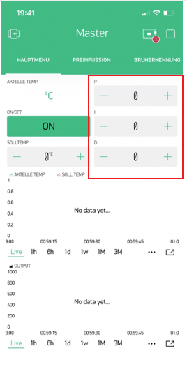
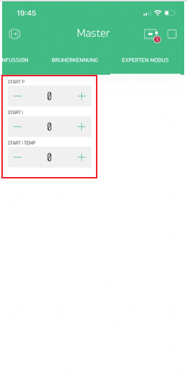
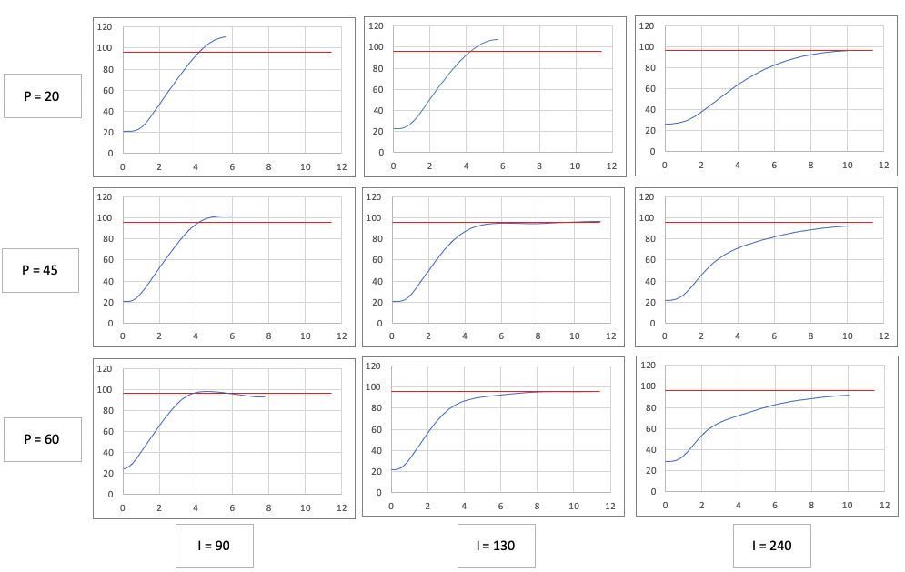

# PID-Werte
{: .no_toc }

Inhaltsverzeichnis

* TOC
{:toc}

## Einleitung

Hier möchten wir dir die wesentlichen Bedienelemente der PID in Blynk erläutern und dich bei den ersten Schritten hin zu einem besseren Espresso mit deinem eigenen PID unterstützen.

## Einführung

Wir haben festgestellt, dass ein Regler benötigt wird, um perfekt auf Solltemperatur zu regeln und dieser übergibt dann an den zweiten Regler für den regulären Betrieb. Dieser muss sich dann um das perfekte Regeln am Sollpunkt kümmern. Der Brühvorgang stellt eine besondere Abweichung dar, die wir versuchen mit der Brüherkennung zu optimieren. Auch dies ist ein separater Regler.

Bereich | Erklärung
:--|:--
1 | Kaltstart
2 | Regulärer Betrieb
3 | Brüherkennung (BD)

Es ist empfehlenswert, unter dem Punkt Brüherkennung diese am Anfang zu deaktivieren. Dies erreichst du mit einem **brew heater detection limit** von 0 (V34). Dann stört diese nicht beim ersten Betrieb. Die Brüherkennung wird im nachfolgenden [Teil](brueherkennung.md) genauer erläutert.

Es somit drei Regler/Bereiche:

* Kaltstart (P und I) – Hinweis zum Expertenmodus beachten!
* „regulärer Betrieb“ (P, I und D) – muss eingestellt werden
* Brühvorgang (siehe nächstes Kapitel) – sollte am Anfang deaktiviert werden.

Der Kaltstart ist aktiv bis zur Solltemperatur, danach gilt der reguläre PID. Wir haben die User Config (userConfig.h) so vorkonfiguriert, dass dieser Kaltstart ohne euer Zutun mit Standardwerten funktioniert. Diesen könnt ihr aber auch selber konfiguriert werden. Den PID für den regulären Betrieb findet ihr im „Hauptmenü“. Natürlich müsst ihr auch eine Solltemperatur definieren.

Reguläre PID Einstellung (roter Kasten)

Der Kaltstart befindet sich im „Expertenmodus“ Reiter in der Blynk App. Dieser ist nur aktiv wenn in der **User Config „Coldstart = 2“ gewählt wird!** Sonst gelten vordefinierte Standardwerte.

Kaltstart im Expertenmodus

Aktuell wird die Start I Temp nicht ausgewertet, da diese bei einer älteren Version vom Kaltstart benötigt wurde.

## Reguläre PID Einstellung

Ohne eine vollständig Abhandlung über einen PID Regler zu liefern, kann kurz und knapp der Einfluss des Reglers wie folgt beschrieben werden:

Der P Anteil – auch Kp genannt – verstellt die Heizleistung proportional zur Reglerabweichung. Bei 20 °C Abweichung und P = 20 ergibt sich 400, bei P = 10 ergeben sich 200. Ein Regler mit nur einem P Anteil neigt zum Schwingen.

Der I Anteil – genauer gesagt Tn – ist dafür da, eine stetige Reglerabweichung zu korrigieren, indem sich dieser über eine Integralbildung die vergangene Abweichung „merkt“. Es ist quasi das Gedächtnis des Reglers. Je kleiner Tn (vereinfacht in der App als I bezeichnet), desto stärker greift der I Anteil im Regler ein.

Der D Anteil ist dafür da auf plötzliche Reglerabweichungen zu reagieren. Hierbei wird die zeitliche Veränderung / Steigung analysiert. Der D Anteil ist für das „schnelle Eingreifen“ hilfreich.

Ein PI Regler – ohne D Anteil – reicht bei einer Espressomaschine im normalen Betrieb vollkommen aus, um diese auf ca. 0,1 °C genau zu regeln. Dennoch könnt ihr gerne D anpassen, falls es euch hilft.

Anmerkung: Der PI Regler im Kaltstart verhält sich aber anders.

Es gibt für Blynk Standardwerte für den regulären PID Betrieb, den wir unten für einige Maschinentypen zusammengetragen haben:

Maschine |	P |	I |	D
:-|-|-|-
Rancilio Silvia (nicht isoliert) | 33 | 255 | 0 |
Rancilio Silvia E ( isoliert) | 25 | 250 | 0 |
Gaggia (Modell 9480 & 9303) | 67 | 670 | 0
Gaggia (Modell 9403) | 55 | 800 | 0
E 61 | 70 | 150 | 0
Quick Mill (Modell 0835 & 3000) | 80 | 75 | 0

## Kaltstart
Wichtiger Hinweis vorweg: Das Verhalten von P & I im Kaltstart ist anders als bei einem normalen PI(D), bitte schaut euch dazu die unteren Grafiken an. 
Folgendes Video erklärt den Kaltstart sehr anschaulich:

Wir haben die User Config (userConfig.h) so vorkonfiguriert, dass diese ohne euer Zutun mit Standardwerten funktioniert. **Diesen könnt ihr aber auch selber Konfigurieren, wenn in der Userconfig Coldstart = 2 gesetzt ist, ihr könnt nicht die PI Werte vom normalen PI nehmen.**

Beispiele für mögliche Parametersätze findet ihr in der nachfolgenden Tabelle:

Kaltstart PI Werte Maschine |	P |	I
-|-|-
Rancilio Silvia (nicht isoliert) | 45 |	130
Rancilio Silvia E (isoliert) | 35 |	130
Gaggia (Modell 9403, Baujahr 2015) |	23 | 175
E 61 |	70 |	96
Quick Mill (Modell 0835 & 3000) | 250 | 35

Folgende Grafik soll euch bei der Einstellungen vom Kaltstart helfen, wenn ihr diesen selber einstellen wollt. Das Grundprinzip des Reglern beim Kaltstart ist hier beschrieben (auf Englisch): [Link](http://brettbeauregard.com/blog/2017/06/introducing-proportional-on-measurement/). 

Diese Grafik zeigt euch qualitativ, wie sich die Kaltstartkurve verschiebt, wenn P oder I verändert werden. Das Ziel von dem Kaltstart sollte sein, dass die Maschine ohne ein nennenswerte Überschwingen perfekt auf die Solltemperatur landet. (vgl. Kurve P 45, I 130).

Das deutliche Überschwingen sollte vermieden werden, da der I Anteil übergeben wird an den neuen Reglerabschnitt. Der Regler hat dann deutlich schwieriger die Solltemperatur sofort zu halten. Dies ist aber auch nur eine Empfehlung, manche Spülen sowieso und stört das Überschwingen nicht oder warten trotzdem 20 Minuten bis zum ersten Espresso.
Die genannten Werte (P,I) dienen mehr zur Orientierung und sollen euch helfen, wenn ihr den Kaltstart selber einstellen möchtet. Man sollte nicht zwei Werte gleichzeitig verändern, da dies bei der Auswertung hinderlich sein könnte.

Falls ihr völlig andere Parameter nutzen müsst, da ihr einen anderen Maschinentyp habt, kann euch auch der Kurvenverlauf helfen, wie ihr P oder I nacheinander verändern müsst, um die Kurve optimal einzustellen.

## Fall 1) Maschine heizt zu langsam auf

Hier kann es helfen erst mal I zu reduzieren und dann zu sehen, ob die Kurve sich schneller an die Solltemperatur annähert. Danach könnte I wieder auf den ursprünglichen Wert eingestellt werden, P angepasst werden, falls die Kurve immer noch zu flach ist und ggf. diesen „leichten Knick“ (ca. bei 2 Minuten zu sehen) hat (siehe Bild P=60 und I=240 und P=45 und I=240).

## Fall 2) Maschine schwingt über

Hier könnte es helfen erst P zu erhöhen. Falls dies nicht hilft, kann man P wieder auf den ursprünglichen Wert zurückstellen und I leicht erhöhen, dann seht ihr, wo ihr euch in dem „Kennfeld“ befindet.
