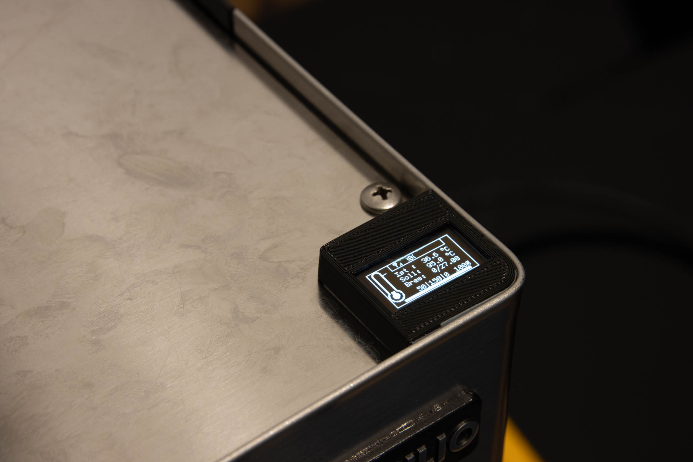

#   {{ page.title }}

  

    Inhaltsverzeichnis
  

  {: .text-delta }
1. TOC
{:toc}

Grundsätzlich würde ich alle Kabel erstmal mit einer Kabellänge von ca. 60 cm abschneiden. Nach dem Einbau auf Seite 1 und dem Verlegen sollten diese beim Anschließen an Seite 2 gekürzt werden.

Vorbereitung:
* ESP bespielen (ggf. sicherstellen, dass das WLAN funktioniert)
* PCB zusammenlöten (Link zur Anleitung folgt)
* ggf. Blynk einrichten und verbinden
* ggf. Displayhalter drucken / bestellen

Zeitaufwand:
* PID Only ca. 3 h
* Vollaubau weitere 2-3 h

## Zerlegen

Als erstes muss die Maschine zerlegt werden. Hier findet ihr einen [Link zur Demontage](https://clevercoffee.de/rancilio-silvia-demontage/).

## PID only

### Thermostat gegen Temperatursensor tauschen

Kabel (0,14mm2) am Temperatursensor anlöten und mit Schrumpfschlauch versehen. **!!!Unbedingt Pinbelegung beachten!!!** Es empfiehlt sich folgende Belegung zu verwenden:

> Rot = +  
> Schwarz = -  
> Grüne = Signal

Freies Kabelende beschriften

Stecker mit rotem Kabel und Stecker mit grauem Kabel abziehen.

Schrauben 1 + 2 lösen.
Schraube 3 ein wenig lockern.
Das alte Thermostat beiseite legen und aufheben; bereich von der Wärmeleitpaste reinigen.

Bügel mit Schraube, Beilagscheiben und Muttern vorbereiten. Bügel wieder einbauen dabei Schraube 3 und 2 festziehen, 1 noch etwas locker lassen.

Die neue Schraube mit Hilfe der zwei Muttern so einstellen, dass die Schraube auf dem Temperatursensor aufliegt. Muttern festziehen.
Temperatursensor auf der Unterseite mit etwas Wärmeleitpaste versehen, unter der neuen Schraube platzieren und Schraube 1 anziehen. Der Bügel sollte sich dabei leicht verformen. So wird sichergestellt, dass der Sensor fest sitzt, aber nicht zu sehr gequetscht wird.  

### Stromversorgung

1,5mm2 Kabel blau mit Flachsteckhülse mit Abzweig versehen und in den abgezogenen Stecker mit Rotem Kabel stecken.
Ein weiteres 1,5mm2 Kabel blau mit Flachstecker versehen und ebenfalls einstecken. Alles mit einem Schrumpfschlauch versehen.
Kabel eins geht zum SSR der Heizung, Kabel zwei zum Netzteil. Welches Kabel dabei wofür verwendet wird ist egal.

1,5mm2 Kabel schwarz mit Flachsteckhülse mit Abzweig versehen. Den unteren Stecke am Schutzschalter abziehen, auf den Abzweig stecken und beides direkt wieder anstecken.

Kabel sinnvoll verlegen und einen Platz für das Netzteil festlegen. Kabel vor dem anschließen entsprechend kürzen.

Wenn man das Netzteil aus der Bestellliste nimmt, verbindet man Eingang N blau mit blau und Eingang L schwarz mit braun.
Der Ausgang von Netzteil schwarz-rot kommt dann auf den V_IN 5V Eingang am PCB.

### SSR Relais Heizung

Montagepunkt für das SSR festlegen. Es kann bei der Rancilio Silvia E z.B. über der "CPU" neben dem Wasserschlauch mit doppelseitigem Klebeband angebracht werden. Alternativ befindet sich eine Schraube an der Vorderseite der Maschine (hinter der Abdeckung), auf die das SSR mit einer Mutter festgeschraubt werden kann.

An Kabel 2 (blau) des Schrittes oben, eine Ringöse pressen (Kabel vor dem Anschließen entsprechend kürzen) und an einen beliebigen Pol des SSR-Ausgangs anschließen.
Ein weiteres Kabel 1,5 mm2 mit einer Ringöse versehen und am zweiten Pol des SSR-Ausgangs befestigen. Kabel zum Stecker mit dem grauen Kabel verlegen, welches ursprünglich am Thermostat war und entsprechend kürzen. Einen Flachstecker aufpressen und anschließend mit einem Schrumpfschlauch versehen.

Zwei Kabel (rot und schwarz) an der Eingangsseite des SSR anschließen. Ich habe dafür 0,5 mm2 Kabel verwendet und ebenfals Ringösen aufgepresst. Es können aber auch die 0,14 mm2 Kabel mit Aderendhülsen o.ä. verwendet werden.
Freie Kabelenden beschriften und richtung 3-Wegeventil legen.

### Einbau des Controllers

Der Microcontroller (ESP) sollte auf das von uns bereitsgestellte Adapterboard (PCB) gesteckt werden. Dieses kommt mit Klebefüßen, so dass es an einer beliebigen günstigen Position befestigt werden kann, an der die Kabel zusammenlaufen. Dies kann im hinteren oder vorderen Teil der Maschine sein, je nach Modell.

## Vollausbau

**Wichtig!: Beim anschließen des Brühschalters bitte unbedingt den Hinweis im Schaltplan zur Trennung von 230V und 3.3/5V am Schalter beachten.** (Wer der Anleitung unten folgt, muss nichts "zusätzlich" beachten.)

### Silvia (v2)

Beim Vollausbau werden sowohl Kaffebezug (inklusive 3-Wege-Ventil) und Dampfbezug über den ESP gesteuert. 
Dazu gibt es grob drei Arbeitsschritte, die unten genauer ausgeführt werden.
1. Schalter auf LED umrüsten
2. Pumpe anschließen
3. Magnetventil anschließen

#### Schalter Umrüsten

Es müssen sowohl der Schalter für Kaffebezug als auch für den Dampf auf LED umgerüstet werden. 
Dazu dieser Anleitung folgen: [LED-Umbau der Schalter](LED_Umbau.md)

Da direkt beide Schalter umgebaut werden, bietet es sich an, je ein gemeinsames Kabel für 3.3V und GND zu ziehen und dieses vom ersten zum zweiten Schalter durchzuschleifen. Inklusive der beiden Signalleitungen braucht es dann nur vier statt sechs Kabel quer durch die Maschine. 

#### Magnetventil anschließen 

1. Vom Hauptschalter L (schwarz) ein Kabel zum Relais für Pumpe und Ventil ziehen. Dieses Kabel werden sich Pumpe und Ventil teilen. Am Ende beim Relais also z.B. eine Wago-Klemme für drei Kabel oder einen Steckverbinder mit Abzweig anbringen. 
2. Weiteres (kurzes) Kabel von Wago/Steckverbinder zu "SW1" auf der 220V-Seite des Relais legen. 
3. Am zweiten Anschluss von SW1 am Relais ein Kabel anschließen. Kabel so ablängen, dass es zum Ventil führt. Steckverbinder anbringen, orangenes Kabel am Ventil abziehen, stattdessen neues Kabel aufstecken. 
4. Weiteres Kabel N (rot) zum Ventil legen und auf den Stecker mit vormals weißem Kabel aufstecken. Ich habe den Strom beim neuen Netzteil für den ESP abgegriffen, im Prinzip eignet sich aber jedes in der Nähe liegende Kabel mit N (rot) vom Hauptschalter. 
5. Kabel für 5V, GND und VALVE vom ESP zum Relais legen. (Wenn Dupont-Stecker am ESP verwendet werden, bietet es sich an, direkt auch die Leitung für das Pumpen-Signal mit anzubringen). Am Relais darauf achten, dass das die Steuersignal korrekt anliegen (wenn Ventil wie oben an SW1 angeschlossen, dann Signal für Ventil an CH1). 
6. Software konfigurieren, flashen, Maschine mit dem Strom verbinden, Bezug testen -- das Ventil sollte deutlich hörbar klacken, wenn der Bezugschalter umgelegt wird. 
7. Vor dem Weitermachen Maschine vom Strom trennen.

#### Pumpe anschließen

1. Ein zweites (kurzes) Kabel von Wago/Steckverbinder aus Schritt 1 des Ventil-Anschlusses zu "SW2" auf der 220V-Seite des Relais legen. 
3. Am zweiten Anschluss von SW2 am Relais ein Kabel anschließen. Kabel so ablängen, dass es zur Pumpe führt und einen Steckverbinder mit Abzweig anbringen. Das weiße Kabel an der Pumpe abziehen, auf den Abzweig des neuen Kabels stecken, und gemeinsam wieder an der Pumpe anbringen. 
4. Wenn nicht beim Anschluss des Ventils schon erledigt, Kabel für das Steuersignal der Pumpe vom ESP zum Relais legen (wenn Pumpe wie hier beschrieben an SW2 angeschlossen, dann Signal für Pumpe an CH2). 
5. Maschine an Strom anschließen, Bezug testen. 
5.1. Wenn alles funktioniert: Glückwunsch, Vollausbau abgeschlossen! 
5.2. Wenn die Pumpe nichts tut: Vermutlich schaltet dein Relais nur beim Nulldurchgang (mehr Info hier: [Bestellliste](../bestellliste.md)). Um das zu testen, einen 100k Ohm Widerstand (Leistung 1 Watt, bitte weitere Hinweise in der Bestellliste beachten) parallel zur Pumpe anschließen. Ich habe dazu beide Kabel an der Pumpe abgezogen und die Stecker abgeknippst. Dann neue Stecker anbringen und dabei zusätzlich zum Kabel jeweils ein Beinchen des Widerstands mit verpressen. Danach müssen die Kabel vorsichtig (und gemeinsam) angebracht bzw. abgenommen werden, da sie jetzt durch den Widerstand verbunden sind. Zum Abschluss noch einmal Bezug testen und den Vollausbau genießen! 

## Display

Es gibt unzählig viele Möglichkeiten das Display zu positionieren. Folgend könnt ihr zwei Beispiele sehen:

Displayhalterung | Powered by Dremel
:---:|:---:
|

Wer einen Dremel besitzt, etwas Geschick mitbringt und kein Problem damit hat, dass Änderungen irreversibel sind, kann damit eine sehr saubere und solide Lösung ausarbeiten.

Wer hintgegen eine reversible Lösung sucht muss sich um eine Displayhalterung (aka 3D Case) bemühen. Eine "Standardlösung" ist aktuell nicht bekannt, aber für alle 3D-Drucker Besitzer, liegen entsprechende Vorlagen auf [Github](https://github.com/rancilio-pid/ranciliopid-handbook/tree/main/3d-designs) (inkl. [Anleitung](https://github.com/rancilio-pid/ranciliopid-handbook/blob/main/3d-designs/Einbauanleitung.pdf) für den Einbau und die Magnete):

* [Rancilio STL](https://github.com/rancilio-pid/ranciliopid-handbook/blob/main/3d-designs/Case%20Rancilio.stl){:target="_blank"}
* [Gaggia STL](https://github.com/rancilio-pid/ranciliopid-handbook/blob/main/3d-designs/Case%20Gaggia.stl){:target="_blank"}
* [Universal-Halter](https://www.thingiverse.com/thing:4897546){:target="_blank"}
* [Halterung zum reinklicken](https://www.thingiverse.com/thing:4662947){:target="_blank"}

## Spannende Addons die gleich mit erledigt werden können

* Senkschraube am Sieb
* Reinigung der Wasserschläuche (sofern die Maschine nicht neu ist)
* [LED-Umbau der Schalter](LED_Umbau.md)

## Ausblick

Features die ebenfalls eingebaut werden können:

* digitales Manometer
* [integrierte Waage](Waage.md)
* Silvia E Zeit für automatisches Ausschalten verändern
* Automatische Funktion zum Wechsel von Dampf auf Brühen
