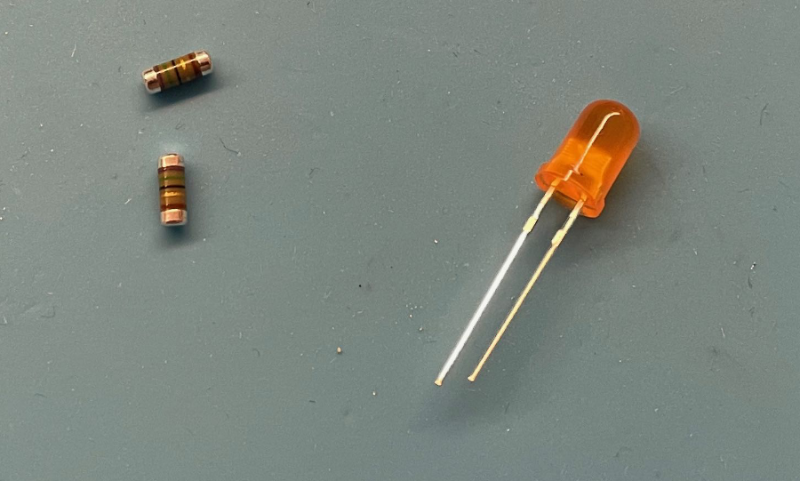
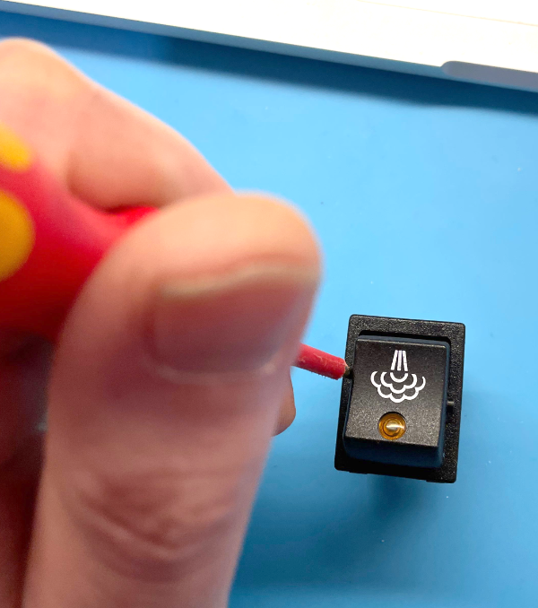
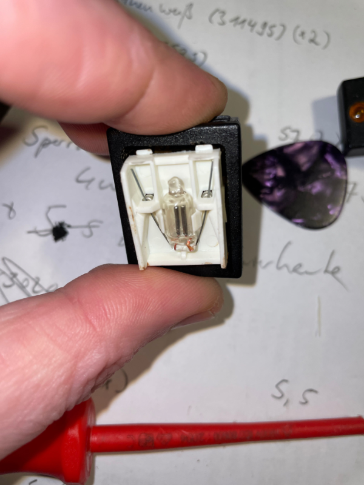
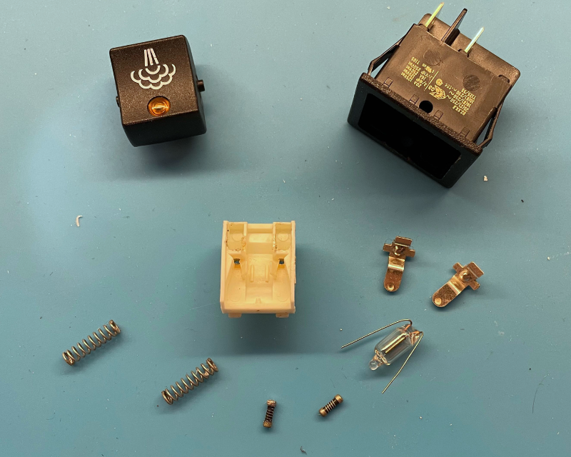
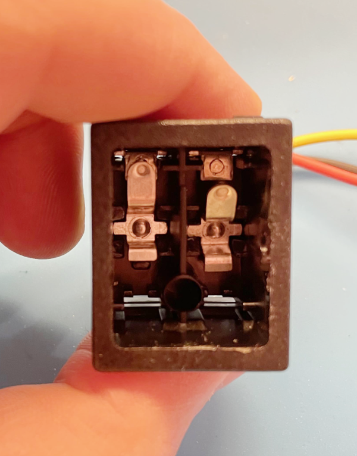
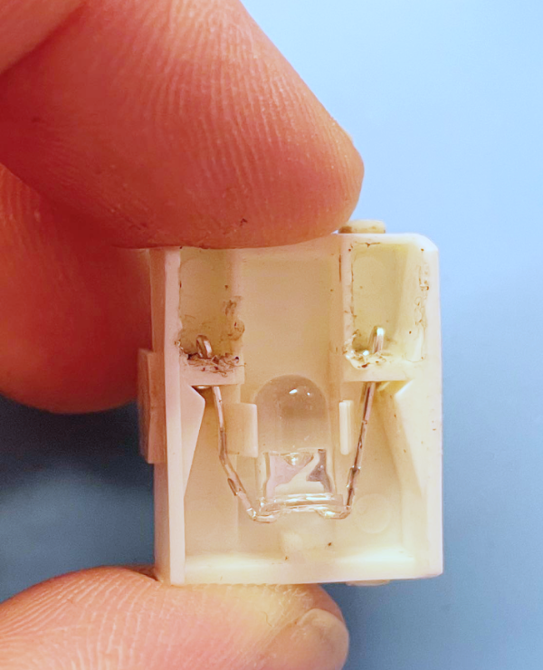
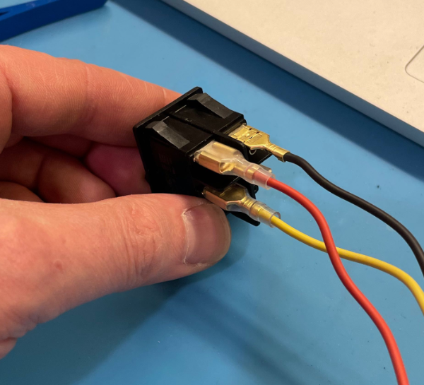
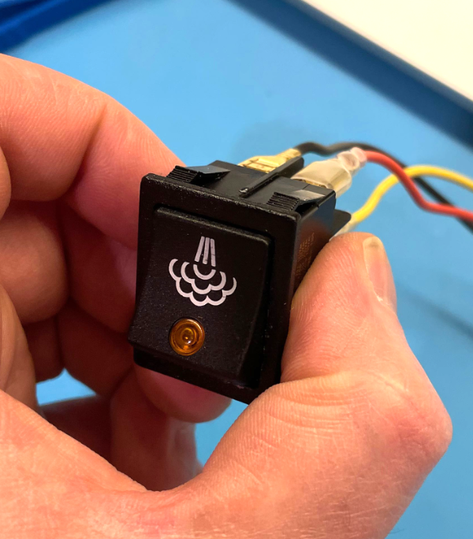

# LED-Umbau der Wippschalter
{: .no_toc }

Inhaltsverzeichnis

* TOC
{:toc}

## Warnhinweis

> {{ site.warnhinweis }}

## Einleitung
Wir möchten die Schalter von 230V auf 3.3V bzw. 5V umbauen um das Signal direkt ohne Optokopller o.ä. an den Mikrocontroller weitergeben zu können. Dies ist glücklicherweise recht einfach ohne Löten oder änhliches und vor allem reversibel möglich. Der größte Aufwand hierbei ist es, dass ein Teil der alten Verkabelung raus muss und die Schalter neu verdrahtet werden müssen, hierzu aber am Ende des Kapitels mehr. 

Was brauchen wir für den Umbau  
- Jeweils 1x LED der gewünschte Farbe in 5mm  
- Pro Schalter 2x Widerstände der Bauform SMD 0207 MELF

Als LEDs eignen sich für die Rancilio am besten LEDs in der Farbe Orange/Amber mit einer nicht all zu großen Helligkeit. Bisher als recht passend erwiesen haben sich diffuse LEDs mit einer Helligkeit im Bereich von 1800 mcd.   
Die Widerstände müssen passend zu der LED und der gewünschten Spannung ausgewählt werden (3.3V oder 5V).
Am einfachsen nimmt man hierfür einen LED-Widerstandsrechner wie z.B. folgenden:  
[https://www.leds-and-more.de/catalog/resistor.php]()  
Am Beispiel einer orangen LED mit einer Durchlassspannung von 1.8 V und einer Stromaufnahme von 20 mA bei einer Betriebsspannung von 3.3V ergibt dieser dann 75 Ohm. Bei den bisher verwendeten LEDs war das Licht durch den Schalter noch recht intensiv deshalb habe ich einfach den Widerstand verdoppelt. Wer sich nicht ganz sicher ist, besorgt sich am besten vorher die LEDs und testet mit nem handelsüblichen Widerstandssortiment oder Potis die Helligkeiten aus. Im Beispiel brauchen zu den LEDs pro Schalter 2 MELF Widerstände mit jeweils 75 Ohm. Das sieht dann wie folgt aus:

## Der Ausbau
Als erstes Maschine vom Netz trennen und nicht nur ausschalten! Dann erstmal alle Kabel von den umzubauenden Schaltern ab. Die Schalter werden jeweils oben und unten mit 2 Rastenasen im Gehäuse gehalten. Hier am besten von oben nach unten die Schalter der Reihe nach ausbauen. Mit den beiden oberen Nasen des ersten Schalters anfangen. Mit einem Schraubenzieher oder ähnlichem die Rastnasen nach unten drücke und den Schalter leicht nach vorne aus der Maschine kippen. Dann mit den Fingern oder irgendeinem passenden Werkzeug (Küchenutensilien zählen auch als Werkzeug) die beiden untere Rastnasen drücken. Das ganze ist bisschen fummelig, aber der Schalter lässt sich in der Regel langsam nach vorne rauswandern. 

Wenn wir nun den Schalter von uns haben nacheinander von beiden Seiten mit einem schmalen Schraubendreher die Kappe des Schalters nach vorne raushebeln. 

In dem Schalter finden wir die Schaltwippe selber mit einer 90V Neonsingalbirne, zwei Spiralfedern, zwei Widerstände und zwei Blattfedern unter der Schaltwippe. Die Widerstände sind von hinten unter den Spiralfedern versteckt und werden von diesen gehalten. Zum Zerlegen erst die Federn abziehen, dann die Widerstände raus, jetzt sollte die Birne schon fast von alleine herausfallen.  

 
 

Die Neonbirne und beide Widerstände tüten wir ein und legen sie beiseite falls die Schalter irgendwann mal wieder zurück gebaut werden sollten. 

## Zusammenbau
Jetzt geht es auch schon wieder an den Zusammenbau. Beim Einbau der LED daran denken, dass diese eine Durchflussrichtung hat. Wenn wir von vorne auf den Schalter schauen möchten wir die Anode (+) der LED auf der rechten Seite haben. Die positive Seite der LED erkennt man daran, dass diese ein längeres Beinchen besitzt. Zudem ist die negative Seite der LED meistens am Kunstoff abgeflacht. 
Da die Beinchen der 90V Glühlampe bisschen dicker sind als die einer LED und in meinem Fall auch die Widerstände minimal kürzer, empfiehlt es sich die Beine der LED einmal zu falten. Damit kann der Dickenunterschied einfach überbrückt werden.

Wer an dieser Stelle z.B. den Brühschalter zu einem Taster umbauen möchte, der kann an dieser Stelle einen alten Kugelschreiber opfern. Einfach die Kugelschreiberfeder in das Loch in dem Schaltergehäuse stecken. Je nach Feder diese eventuell noch kürzen. 

Den Schalter jetzt in umgekerter Reihenfolge wieder zusammenbauen. Am Ende sollte es so aussehen. 

Wenn alle Schalter umgebaut sind können diese wieder in die Maschine eingesetzt werden. Als nächstes folgt dann die Verkabelung.

## Verkabelung

An dieser Stelle folgen später noch Schaltpläne je nach Ausbauart. Fürs erste gibts nur eine kurze Textbeschreibung für den Anschluss der Schalter als High-Trigger, also positiv schaltend.  
Auf der Rückseite der Schalter befinden Nummern für die Anschlüsse von 1-6, wobei hier nur die Anschlüsse 1,2,4,5 wirklich belegt sind. Vorrausgesetzt die LED wurde so wie oben beschrieben eingebaut, sieht die Belegung wie folgt aus:  

- VCC auf 1
- Signal auf 2
- GND auf 4

Wobei sich alle Schalter auch VCC und GND teilen können und Signal geht dann jeweils von dem Schalter zu den jeweiligen Eingängen auf dem Board. Da die meisten von euch, gerade beim ESP, nicht mehr genügend Eingänge frei haben werden um alle Schalter anzuschließen, kann z.B. der Wasserbezugschalter direkt mit an den Eingang des Relais für die Pumpe angeschlossen werden. In diesem Fall geht dann der Signal Ausgang (2) vom Schalter mit auf den Schalteingang des Reilais. Zur Zeit wird das im PID mit dem Signal des Wasserbezugs sowieso keine Funktion ausgelöst.
Hier noch ein Bild des fertig verdrahteten Schalters.

 

## To be continued
Als nächste wollte ich versuchen die LEDs der Schalter unabhängig vom Schaltzustand anzusteuern. Da hierfür nicht genügend Ausgänge auf den Boards frei sind werde ich mit einer Erweiterungsplatine experimentieren. Bei Rückfragen einfach im Chat fragen oder sich dort direkt an mich @derchristian wenden.

Erstellt am 18.05.2021 von Christian (@derchristian)  
zuletzt geändert am 18.05.2021 von Christian (@derchristian)

