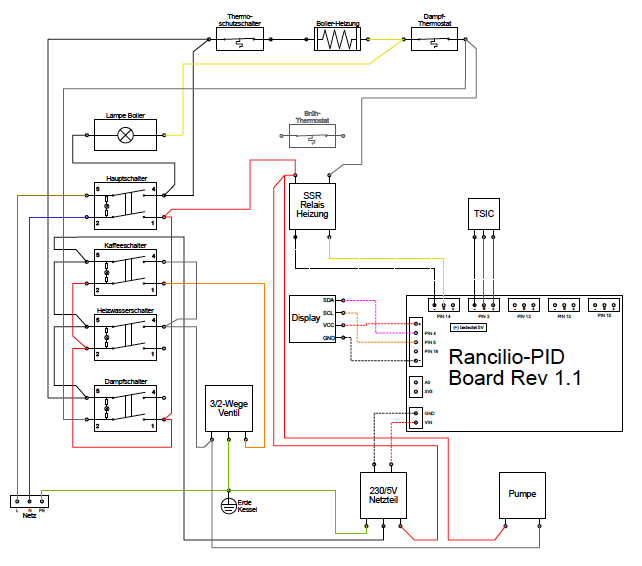
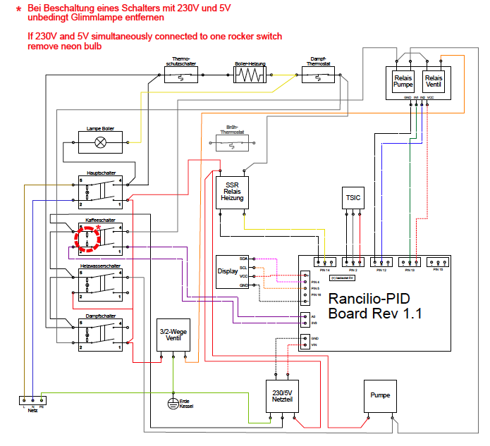

# Schaltpläne
{: .no_toc }

Inhaltsverzeichnis

* TOC
{:toc}

## Warnhinweis

> {{ site.warnhinweis }}

## Einleitung

Wenn der Test erfolgreich war, kannst du beginnen deinen Einbau zu planen. Je nach Ausbaustufe musst du nur das Netzteil und Controller mit Strom versorgen, den Temperatursensor einbauen am Kessel. Wir zeigen dir hier am Beispiel der Rancilio Siliva wie der Umbau gelingt. Weiter Maschinen, wie z.B. die Gaggia wurde auch schon erfolgreich umgebaut.

## Rancilio

### Originaler Schaltplan 

Der erste Schaltplan zeigt den original Zustand der Silvia vor dem Umbau.

### "Only PID"

Der zweite Schaltplan zeigt die PID Anpassung.
Diese Version ist nur für die Temperatursteuerung verantwortlich.
Die Pumpe und das 3-Wege-Ventil werden nicht durch den Controller gesteuert.

### "Vollausbau"

Der dritte Schaltplan ist der aktuelle „Vollausbau“.
Enthalten ist die PID für die Kesseltemperatursteuerung
Zusätzlich kann auch die Brühzeit oder eine „Preinfussion“ gesteuert werden. (Vorlauf-Brühzeit, Pause, Brühzeit).
Dabei werden Pumpe und das 3-Wege-Ventil vom Controller gesteuert.

**WICHTIGER HINWEIS: Dieser Umbau darf nur am Brüh-Schalter vorgenommen werden, wenn ein Schalter ohne Lampe genommen oder die Lampe ausgebaut oder eine neue Verkabelung gewählt wird, dass mit eingebauter Lampe KEINE 3,3 Volt und 230 Volt am Schalter anliegen! Sonst liegt KEINE galavanische Trennung zwischen 3,3 Volt und 230 Volt mehr vor! Das kann unter ungünstigen Umständen gefährlich für dich oder den Microcontroller sein!**

