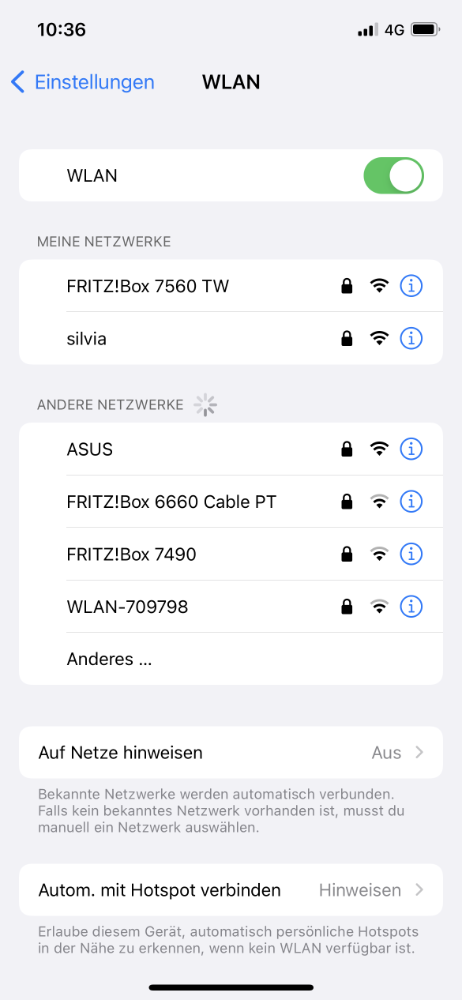
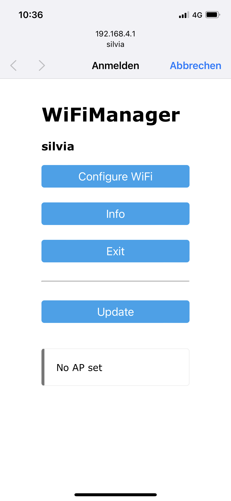
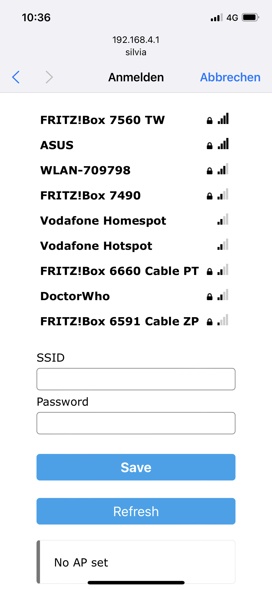
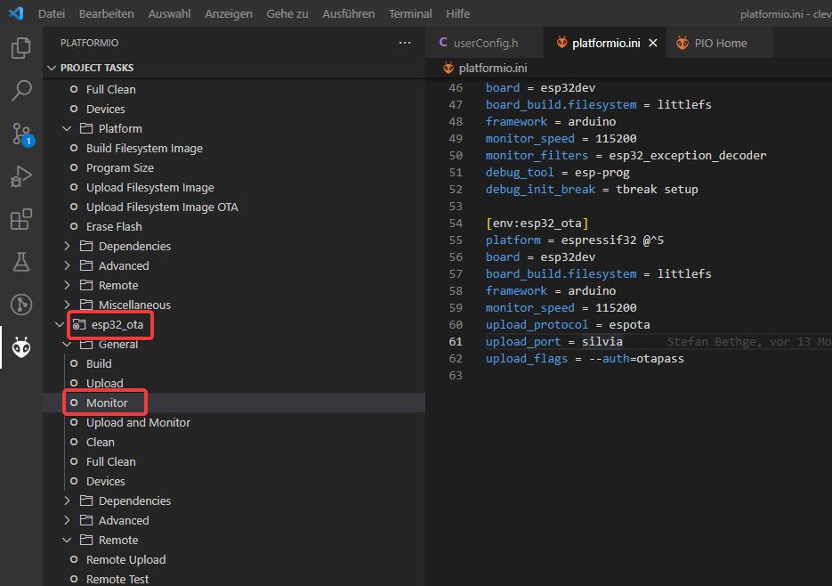

# Ersteinrichtung WLAN
{: .no_toc }

Inhaltsverzeichnis

* TOC
{:toc}

## WICHTIGER HINWEIS
Beim ESP8266 haben wir mir Release 3.3.0 den Wifimanager wieder entfernt, da dieser für einen Absturz bei der Ersteinrichtung geführt hat. Tragt eure Wlan Zugangsdaten bitte in der userconfig.h:

```
#define WIFI_SSID "yourSSID"       // SSID of your WiFi network
#define WIFI_PASS "yourWiFiPass"   // WPA key to your WiFi network
```
Beim ESP32 tritt dieses Problem nicht auf, benutzt vorerst das Release 3.2.0 inklusive Wifimanager und folgt dann weiter dieser Anleitung.

## Kurzfassung

Für die Ersteinrichtung b wird der Wifi-Manager benutzt. Beim ersten Start vom Mikrocontroller wird ein Access Point von diesem geöffnet mit dem in der userConfig.h eingestellten ```HOSTNAME``` (default: "silvia") und Passwort ```PASS``` (default: "CleverCoffee"). Verbindet euch mit dem Access Point, wählt euer WLAN aus und gebt das Passwort des Netzwerks ein, dann wird dieses gespeichert und beim nächsten Start automatisch verwendet.
Der ESP wird immer für 10 Sekunden versuchen, dass eingerichtete WLAN zu erreichen, falls dies nicht möglich ist, wird für 60 Sekunden das Konfigurationsportal wieder gestartet. Falls kein Zugriff auf das Portal passiert, startet die Maschine im Offline-Modus.
## Schritt für Schritt
Wenn ihr den Code hochladet, ist im Log (Monitor-Befehl) etwa folgendes zu sehen:

```
*wm:[1] AutoConnect 
*wm:[1] No Credentials are Saved, skipping connect 
*wm:[2] Starting Config Portal 
*wm:[2] AccessPoint set password is VALID 
*wm:[2] Disabling STA 
*wm:[2] Enabling AP 
*wm:[1] StartAP with SSID:  silvia
*wm:[1] AP IP address: 192.168.4.1
*wm:[1] Starting Web Portal 
*wm:[2] HTTP server started 
*wm:[2] Config Portal Running, blocking, waiting for clients... 
```
Diese IP-Adresse solltet ihr euch notieren, um später die Webseite für die Ersteinrichtung aufzurufen (falls diese nicht automatisch geöffnet wird).
Wenn ihr nun per Mobile/Tablet/Desktop nach einem Wlan sucht werdet ihr das Netzwerk "silvia" sehen.



Wenn ihr euch mit dem Netzwerk verbunden habt, geht eine Portalseite auf oder ihr gibt per Browser die IP 192.168.4.1 ein.



Mit dem Klick auf "Configure Wifi" könnt ihr eurer Wlan auf dem Nodemcu einrichten.



Wählt das Netzwerk oben aus der Liste ein oder gebt eure SSID manuell ein, zusätzlich eurer Passwort vom Wlan.
Nach dem "Save" sollte der ESP neu starten und ist für euer Wlan eingerichtet.

# Remote Monitoring
**Achtung: Der ESP8266 hat mit Version 3.3.0 keine remote monitoring Funktion.**
**Dieser Abschnitt gilt nur für ESP32 mit Version 3.2.0**

Zusätzlich zur Website, auf der ihr Einstellungen vornehmen oder die aktuelle Temperatur beobachten könnt, könnt ihr auch über PlatformIO/VSCode über WLAN auf den Serial Monitor zugreifen. 
Das ist vor allem nützlich, um mögliche Probleme im laufenden Betrieb zu debuggen. Wir raten dringend davon ab, einen in der Maschine verkabelten Mikrokontroller über USB an einen Rechner anzuschließen! 
Wählt stattdessen in PlatformIO esp32_ota --> Monitor aus.



Solltet ihr den Hostname oder das OTA-Passwort in der `userconfig.h` angepasst haben, müsst ihr für eine erfolgreiche Verbindung auch die `platformio.ini` in der Section `env:esp32_ota` anpassen. 

Wichtig, falls ihr Remote Monitoring schon während der Ersteinrichtung testen wollt: Ihr könnt das Monitoring nicht gleichzeitig via Kabel und OTA starten.
