#   {{ page.title }}

  

    Inhaltsverzeichnis
  

  {: .text-delta }
1. TOC
{:toc}

# Einführung

[Visual Studio Code](https://code.visualstudio.com/) ist ein plattformübergreifend verfügbarer Code-Editor, das sich über zahlreiche Plugins erweitern lässt. Eines für die Entwicklung eingebetteter Systeme hilfreichsten Plugins ist [PlatformIO](https://platformio.org/)

## Installationsvideo

In diesem kurzen Video erklären wir die Installation der Arduino IDE und zeigen wie unsere OpenSource Software Rancilio-PID auf dem NodeMCU installiert wird. Viel Spaß!

## Download

Wird benötigt, um den Code auf den Controller zu spielen.

[Link zu Arduino](https://www.arduino.cc/en/Main/Software)

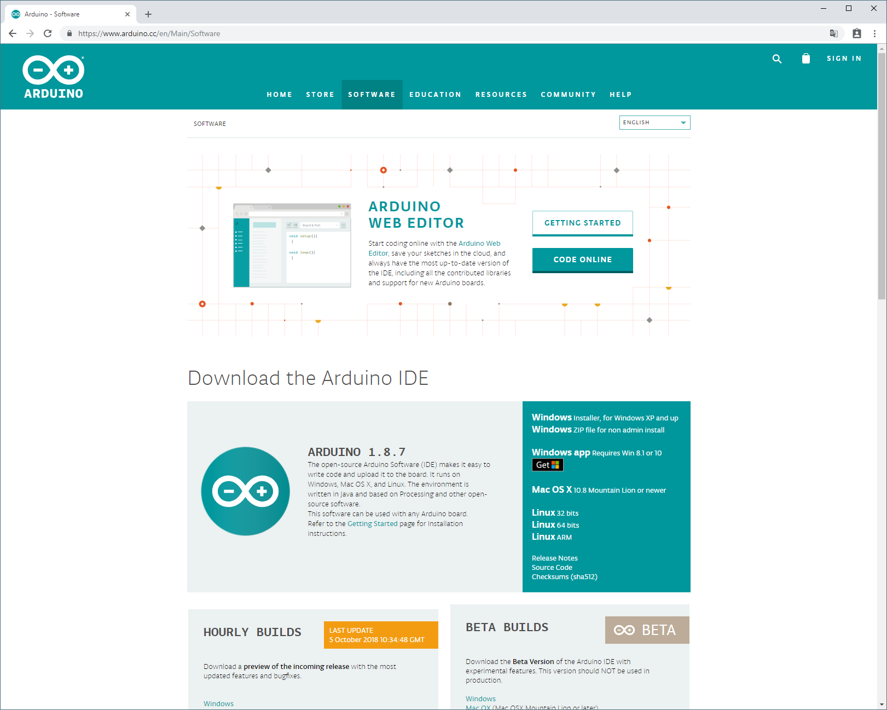

## Der Programmcode

Download des aktuellen Programmcode findest du im aktuellen Release.

[Link zum Github Repository](https://github.com/rancilio-pid/ranciliopid/releases)

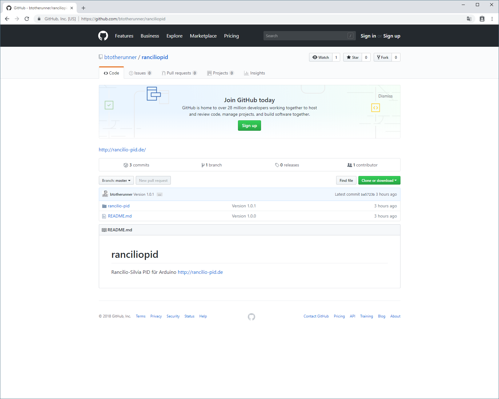

## Installation der Arduino IDE

Hinweise zur Installation befinden sich auf der [Arduino Homepage](https://www.arduino.cc/en/Guide).

Nach der erfolgreichen Installation kann Arduino über das Startmenü gestartet werden.

## Arduino Voreinstellungen

### Boardverwaltungs-URL anlegen

Wir benötigen für den Einsatz des NodeMCUs eine zusätzliche Boardverwaltungs-URL.

Diese erreicht ihr unter: Datei > Voreinstellungen

| Key | Value |
|-|-|
| Boardverwaltungs-URL | `http://arduino.esp8266.com/stable/package_esp8266com_index.json`|

  
 Windows 

  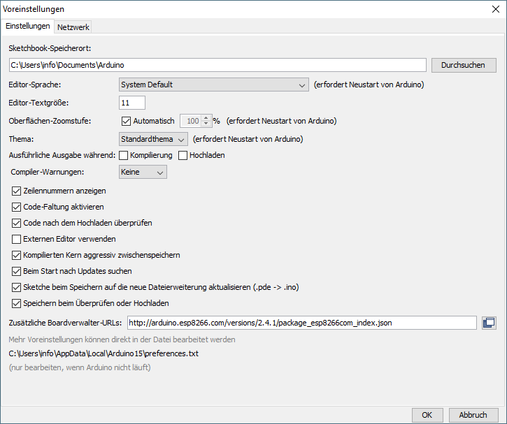

  
 Linux (Ubuntu) 

  

### Boardtreiber installieren

Als nächstes müssen die ESP8266 Boardtreiber installiert werden.

Dies erreicht ihr unter: Werkzeuge > Board: "[\<Version\>]" > Boardverwalter...

  
 Windows 

  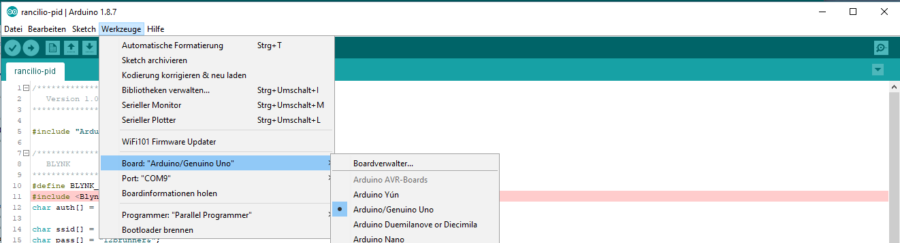

  
 Linux (Ubuntu) 

  

Bitte die aktuelle Version installieren.

Typ \<Alle\> > "esp": "**esp8266** by **ESP8266 Community**"

Nun ist die Arduino IDE vorbereitet. Weiter geht es mit den Bibliotheken.

## Bibliotheken installieren

Der sicherste und einfachste Weg alle Bibliotheken korrekt zu installieren, ist es, die [Bibliotheken aus Github](https://github.com/rancilio-pid/ranciliopid/tree/master/rancilio-pid/libraries) zu nehmen. Diese solltet ihr bereits heruntergeladen haben (siehe [Programmcode](#der-programmcode)). Kopiert die kompletten Ordner einfach in den Arduino Libraries Ordner zu kopieren:

| OS | Arduino Libraries Ordner |
|-|-|
| Windows | `My Documents\Arduino\libraries\` |
| OSX | `~/Documents/Arduino/libraries/` |
| Linux |`~/Arduino/libraries`|

Wie immer ist es empfehlenswert beim offiziellen Guide mehr Infos einzuholen: [Link](https://www.arduino.cc/en/Guide/Libraries).

### Bibliotheken manuell installieren

Alternativ müssen folgende Libraries per Hand installiert werden:

* Blynk
* TimeLib
* WidgetRTC
* U8x8lib
* OneWire
* DallasTemperature
* PID_v1.h
* Adafruit VL53L0X

Die Installation der einzelnen Bibliotheken erfolgt wieder über die Verwaltung in Arduino IDE:

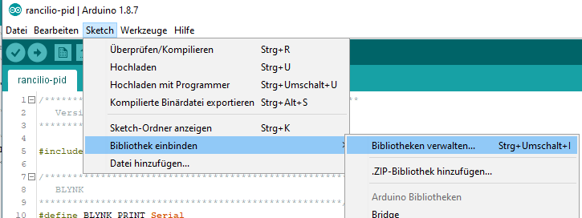

  
 OneWire 

  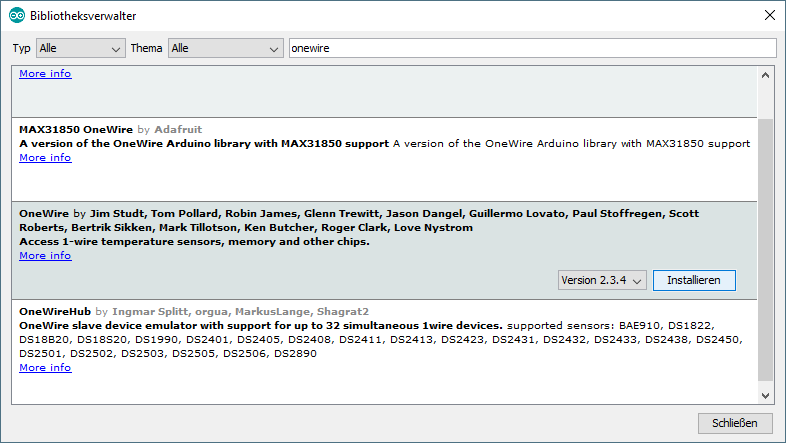

  

    DallasTemperature
  

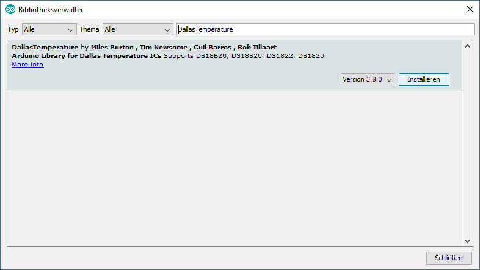

  
 U8x8lib 

  1. Geht auf [https://github.com/olikraus/u8g2](https://github.com/olikraus/u8g2)
  1. Code > Download Zip
  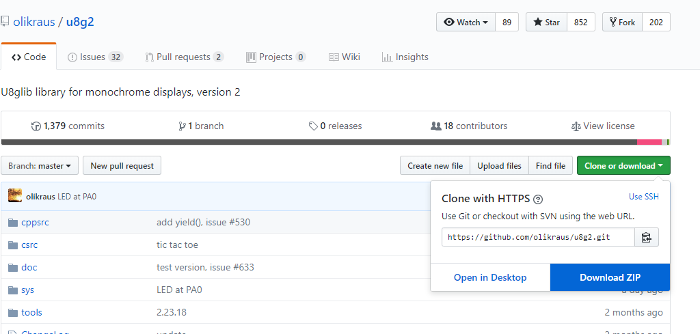
  1. Legt die Dateien im [Arduino Libraries Ordner](#bibliotheken-installieren) ab
  1. Erstellen einen Ordner: `U8x8lib`
  1. Den Inhalt aus dem ZIP File Ordner: u8g2-master.zip\u8g2-master\cppsrc  UND csrc in den neu erstellten Ordner kopieren (ja, es sind eine ganze Menge Dateien :))
  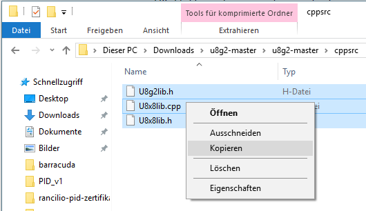
  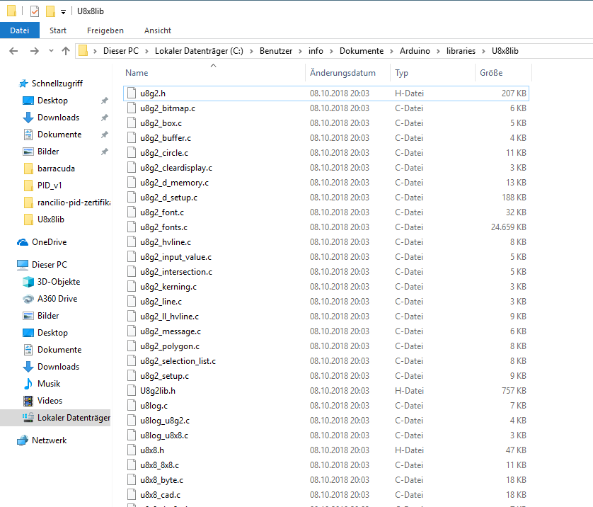  

  
 PID_v1.h 

  1. Geht auf [https://github.com/br3ttb/Arduino-PID-Library](https://github.com/br3ttb/Arduino-PID-Library)
  1. Code > Download Zip  
  
  1. Legt die Dateien im [Arduino Libraries Ordner](#bibliotheken-installieren) ab
  1. Erstellen einen Ordner: `PID_v1`
  1. Die vier Dateien aus dem ZIP File kopieren und in den neuen Ordner einfügen:
  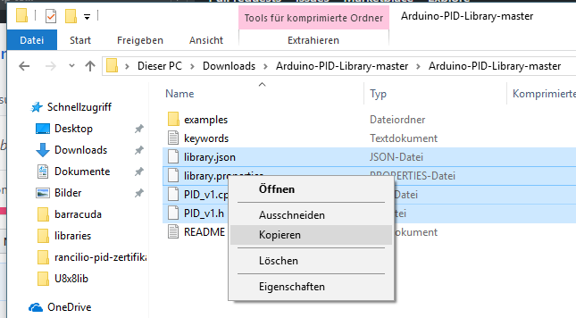
  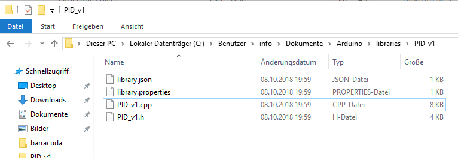  

  
 Blynk 

  1. Geht auf [https://www.blynk.cc/getting-started/](https://www.blynk.cc/getting-started/)
  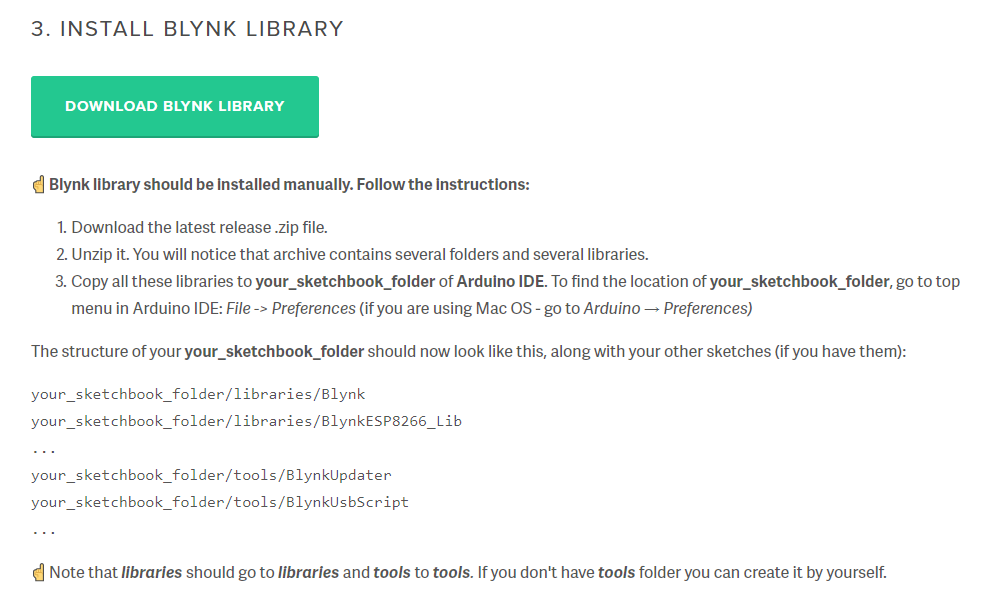
  1. Geht auf [https://github.com/blynkkk/blynk-library/releases/tag/v0.5.4](https://github.com/blynkkk/blynk-library/releases/tag/v0.5.4)
  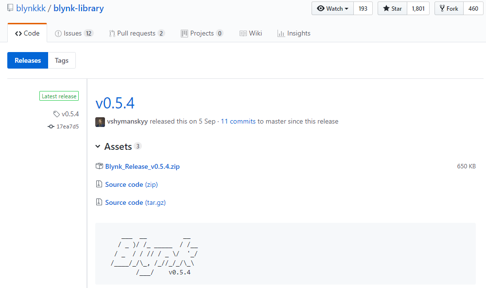
  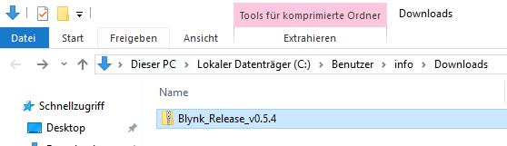
  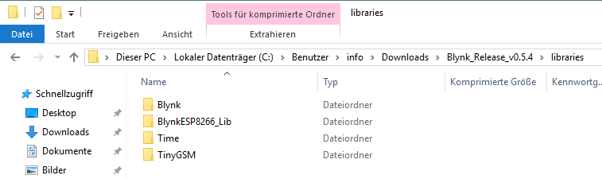
  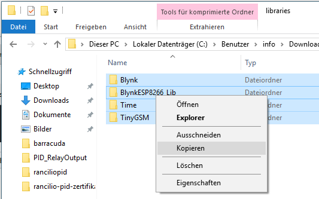
  1. Wechseln in den [Arduino Libraries Ordner](#bibliotheken-installieren)
  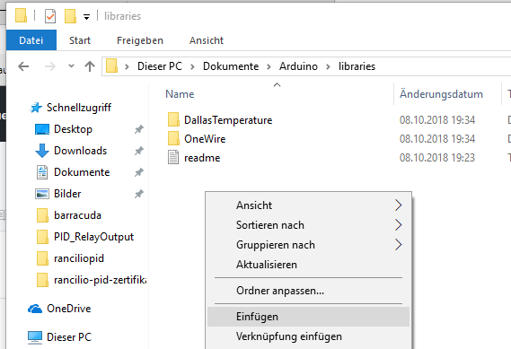
  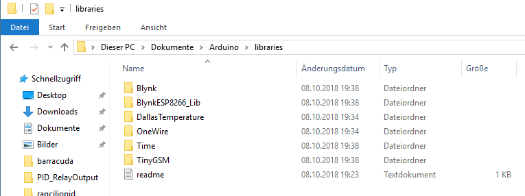  

## Board einstellen

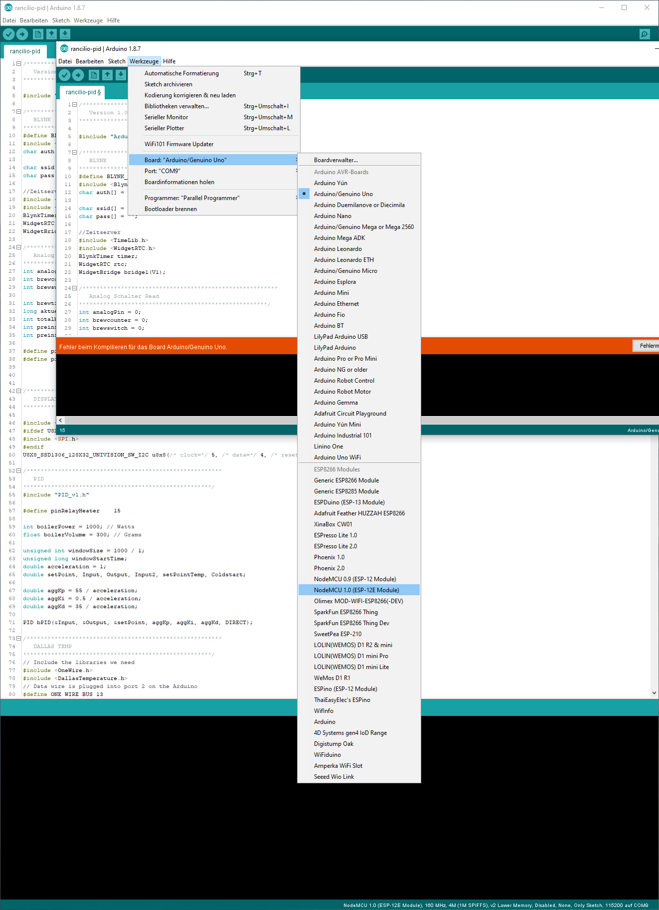
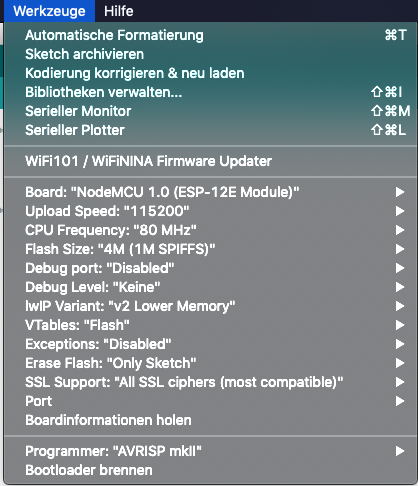

Wenn alle Bibliotheken installiert sind, müsste es wie folgt aussehen:

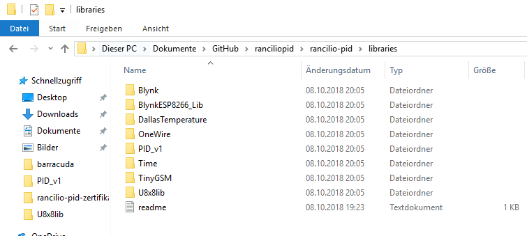

Somit ist alles nun für das Einrichten von Blynk und das Flashen von dem Code vorbereitet. Dann kann der erste Test beginnen.
