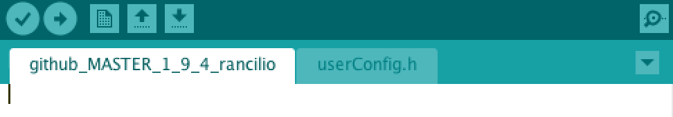
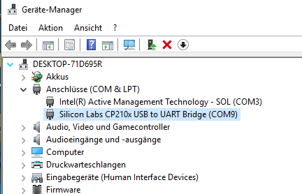
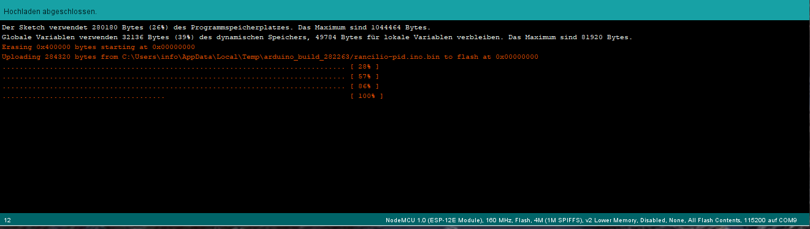
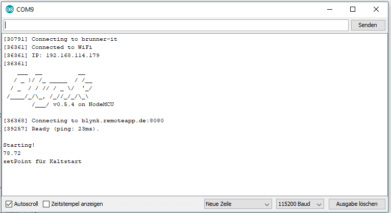

# Software Teil II
{: .no_toc }

Inhaltsverzeichnis

* TOC
{:toc}

## Einleitung

In diesem Kapitel wird beschrieben wie der Code auf den Mikrocontroller (NodeMCU) geladen wird. Damit könnt ihr loslegen, sobald ihr den Mikrocontroller zur Hand habt (weitere Teile werden nicht hierfür nicht benötigt). Für einen Test sollte dann zumindest der Temperatursensor angeschlossen werden.

## userConfig.h
In dem rancilio-pid/rancilio-pid Ordner befindet sich eine für euch wichtige Datei: 
* userConfig_sample.h

Die userConfig_sample.h muss in userConfig.h umbenannt werden und mit euren Werten anpasste werden. 
Alle wichtigen Einstellungen werden für eure PID in dieser Datei vorgenommen, diese werden nun gleich genauer erläutert.
Bei einem Update auf eine neuere Version bitte unbedingt die neuste userConfig_sample.h nehmen und mit eueren Werten anpassen.
Wenn Ihr das nicht tut, kann dies zu unspezifischen, nicht erwünschten Verhalten an der Maschine kommen: Display hängt, PID geht nicht und weitere


## Die Parameter in der userConfig.h

Die userConfig.h ist in mehrere Abschnitte unterteilt. Die wir nun nach und nach euch vorstellen werden. 


### MACHINETYPE, use the exakt name of the machine 
```
MACHINE machine = RancilioSilvia;      //	RancilioSilvia, RancilioSilviaE, Gaggia, QuickMill
```
Hier müsst ihr eure Maschine eintragen, dieser Parameter steuert die Logodarstellung auf dem Display (wenn angeschlossen) und bei der Quickmill die Erkennung des Brühvorgangs und den Dampfmodus bei BREWDETECTION 3 

### MACHINETYPE, use the exakt name of the machine 

siehe ./customization/Displey.md
```
#define DISPLAY 2                  // 0 = deactivated, 1 = SH1106 (e.g. 1.3 "128x64), 2 = SSD1306 (e.g. 0.96" 128x64)
#define OLED_I2C 0x3C		           // I2C address for OLED, 0x3C by default
#define DISPLAYTEMPLATE 3          // 1 = Standard Display Template, 2 = Minimal Template, 3 = only Temperatur, 4 = Scale Template, 20 = vertical Display see git Handbook for further information
#define DISPLAYROTATE U8G2_R0      // rotate display clockwise: U8G2_R0 = no rotation; U8G2_R1 = 90°; U8G2_R2 = 180°; U8G2_R3 = 270°
#define SHOTTIMER 1                // 0 = deactivated, 1 = activated 2 = with scale
#define HEATINGLOGO 0              // 0 = deactivated, 1 = Rancilio, 2 = Gaggia 
#define OFFLINEGLOGO 1             // 0 = deactivated, 1 = activated
#define BREWSWITCHDELAY 3000       // time in ms
#define LANGUAGE 1                 // LANGUAGE = 0 (DE), LANGUAGE = 1 (EN), LANGUAGE = 2 (ES)
```

```
// Wlan and Connection
#define OFFLINEMODUS 0       // 0 = Blynk and WIFI are used; 1 = offline mode (only preconfigured values in code are used!)
#define FALLBACK 1           // 1 = fallback to values stored in eeprom, if blynk is not working; 0 = deactivated
#define OTA true             // true = activate update via OTA
#define MQTT 0               // 1 = MQTT enabled, 0 = MQTT disabled
#define GRAFANA 1            // 1 = grafana visualisation. Access required, 0 = off (default)
#define MAXWIFIRECONNECTS 5  // maximum number of reconnects; use -1 to set to maximum ("deactivated")
#define WIFICINNECTIONDELAY 10000 // delay between reconnects in ms

// PID & Hardware
#define ONLYPID 1            // 1 = Only PID, no preinfusion; 0 = PID and preinfusion
#define BREWDETECTION 1      // 0 = off; 1 = Software; 2 = Hardware
#define COLDSTART_PID 1     // 1 = default COLDStart Values , 2 = eigene Werte via Blynk, Expertenmodusaktiv
#define TRIGGERTYPE HIGH     // LOW = low trigger, HIGH = high trigger relay

//E-Trigger
#define ETRIGGER 0  // 0: no Trigger (for Raniclio without E) 1: Trigger for CPU of Rancilio E
#define ETRIGGERTIME 60 // Seconds, time between for Trigger Signal
#define PINETRIGGER 16 // Pin for Etrigger Relay
#define TRIGGERRELAYTYPE HIGH  // LOW = low trigger, HIGH = high trigger relay for ETrigger

// Wifi -> Infos siehe unten
#define HOSTNAME "Rancilio"
#define D_SSID "myssid"
#define PASS "mypass"

// OTA -> siehe unten
#define OTAHOST "Rancilio"   // Name to be shown in ARUDINO IDE Port
#define OTAPASS "otapass"    // Password for OTA updtates

//MQTT
#define MQTT_USERNAME "myuser"
#define MQTT_PASSWORD "mypass"
#define MQTT_TOPIC_PREFIX "custom/Küche."  // topic will be "<MQTT_TOPIC_PREFIX><HOSTNAME>/<READING>"
#define MQTT_SERVER_IP "XXX.XXX.XXX.XXX"       // IP-Address of locally installed mqtt server
#define MQTT_SERVER_PORT 1883    

// BLynk
#define AUTH "myauth"
#define BLYNKADDRESS "blynk.clevercoffee.de"         // IP-Address of used blynk server
#define BLYNKPORT 8080  //Port for blynk server


//PID - offline values
#define SETPOINT 95  // Temperatur setpoint
#define AGGKP 69     // Kp Normal
#define AGGTN 399    // Tn
#define AGGTV 0      // Tv

// PID Coldtart
#define STARTKP 50   // Start Kp during coldstart
#define STARTTN 150  // Start Tn during cold start


//PID - values for offline brewdetection
#define AGGBKP 50    // Kp
#define AGGBTN 0   // Tn
#define AGGBTV 20    // Tv

//backflush values
#define FILLTIME 3000       // time in ms the pump is running
#define FLUSHTIME 6000      // time in ms the 3-way valve is open -> backflush
#define MAXFLUSHCYCLES 5      // number of cycles the backflush should run; 0 = disabled

//PIN BELEGUNG
#define ONE_WIRE_BUS 2  // TEMP SENSOR PIN

#define pinRelayVentil    12    //Output pin for 3-way-valve
#define pinRelayPumpe     13    //Output pin for pump
#define pinRelayHeater    14    //Output pin for heater

//#define OLED_RESET 16     //Output pin for dispaly reset pin
#define OLED_SCL 5        //Output pin for dispaly clock pin
#define OLED_SDA 4        //Output pin for dispaly data pin
#define SCREEN_WIDTH 128 // OLED display width, in pixels
#define SCREEN_HEIGHT 64 // OLED display height, in pixels  

// Historic, no settings
#define PONE 1               // 1 = P_ON_E (default), 0 = P_ON_M (special PID mode, other PID-parameter are needed)
#define TEMPSENSOR 2         // 2 = TSIC306
```


### Wifi

Unter Wifi müsst ihr euren Auth Token aus Blynk eintragen und eure Wlan SSID und das zugehörige Passwort. Bei der WLAN SSID bitte drauf achten, dass keine Leerzeichen darin enthalten sind! Auch Sonderzeichen machen gerne Schwierigkeiten im Betrieb.

```
#define AUTH "blynkauthcode"

#define D_SSID "wlanname"

#define PASS "wlanpass"
```

### PID

Hier definiert ihr eure initialen PID Werte.


## Code hochladen

Wenn ihr die .ino Datei öffnet, öffnet sich automatisch im zweiten Tab die userConfig.h mit den wichtigen Einstellungen. Danach auf den Pfeil klicken für den Upload auf den Microkontroller. Achtet darauf, dass Ihr den Auth-Code der Blynk-App und die WLAN-Zugangsdaten im Code der userConfig.h hinterlegt habt.



Bitte achtet vorher drauf, dass Ihr in den Board Einstellungen den richtigen COM Port ausgewählt habt.

Diesen könnt ihr auch auch im Gerätemanager prüfen (falls ihr ihn nicht wisst):





## Testen

Wenn alles geklappt habt könnt ihr auf dem Serial Monitor erkennen, wie sich der Microkontroller mit Blynk verbindet.



Klappt das und ist der Temperatursensor korrekt angeschlossen seht ihr am Handy in der Blynk App die Raumtemperatur.
Jetzt könnt iht nach und nach die anderen Bauteile verbinden (Relais) und weiter testen.

### OTA

Hier wird der Update **O**ver **T**he **A**ir eingestellt.

Dafür muss die Maschine eingeschalten sein und sich euer Rechner (mit Arduino) im selben WLAN Netz befinden. Dann erscheint unter Werkzeuge > Port <aktuelle Auswahl> > Netzwerkschnittstellen "Rancilio <IP-Addresse>". Wählt diesen Port aus und lädt den Code entsprechend hoch.
