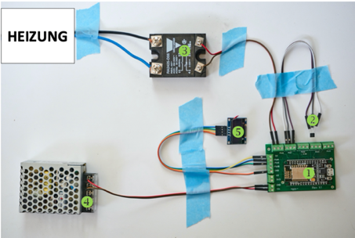

# Introduction PID System
{: .no_toc }

Contents

* TOC
{:toc}

## Why PID control?

With PID control, the water temperature during the brewing can be controlled much more exact and stable than possible with a standard bimetal thermostat. With usual thermostats, the temperature oscillates by about 10 °C, also known as hysteresis. That means that the machine heats until the thermostat reaches its predefined temperature and cuts power to the heating. Now the boiler starts to cool down  more or less quick through dissipation of heat energy into the environment until a certain point is reached where the thermostat kicks in and switches the heating on again.

For making good Espresso, the temperature in the boiler is one of THE crucial parameters. Even a variation of as little as 1 °C can make the difference between too sour (too cold), bitter (too hot) or delicious (just right).  

One method to reach a more defined and reproducible temperature is the so called temperature surfing, a relatively complicated manual procedure with exactly timed heating and flushing steps for which you have to be at the machine the whole time. Many users get annoyed by that, we were too.

The solution for smaller single boiler machines is, to replace the thermostat by a PID controller which will regulate the temperature with a variation significantly below 1 °C, with our system capable to reach an accuracy of up to 0.1 °C.

## What our system can do?

Our DIY PID has the following key figures:

* regulation of the water temperature with an accuracy of +/- 0.1 °C
* brewing time control incl. pre-infusion possible with "full expansion" stage
* easy control via app for Android & iOS
* Data monitoring via Grafana (web based) and MQTT (IoT) possible
* OTA software updates
* PID software is OpenSource: always free and customizable for your own needs
* little space needed, fits in most small Espresso machines
* the stock cabling of the machine stays intact. Machine can be build back into its original state without any problem
* Active community with fast support, suggestions for further extensions are welcome
 

## List of modified machines

Our system was originally developed for use in the Rancilio Silvia but can be used in other machines as well. So far, users have successfully modified the following machines:

 * Rancilio Silvia V1 – V4
 * Rancilio Silvia E(co) V5 & V6
 * Gaggia Classic (9303) / Classic Pro (9480)
 * Lelit PL41 / PL42
 * La Pavoni EPL / Saeco Aroma / Gaggia New Classic (9403)
 * E61 single boiler (Bazzar A1 Livello, Fiorenzato Colombina)
 * E61 single boiler, dual use (Profitec Pro500)

## Differences PID Only vs. full expansion

In principle, our PID consists of the following components:
ID | Explanation
-|-
1 | Micro controller NodeMCU V2                 
2 | Temperature sensor TSIC 306                 
3 | Solid State Relais (SSR)                       
4 | Powersupply               
5 | Display (recommended, but optional)      

There are two different levels of our system: PID only and full expansion

## Basic version (PID Only)

The basic version resembles a classic PID controller: the temperature sensor measures the temperature of the boiler (input) and forwards this information to the PID software running on the Micro controller (in our case NodeMCU). From here a control signal (output) is sent to the SSR which in turn switches the heating on and off. 

By that, the PID software achieves an exact regulation of the brewing temperature while the remainder of your machine stays untouched. MQTT, Display output and control via app are also possible in the basic version. 

## Full expansion

Here, we go one step further and transfer control over the pump and the solenoid valve to the software too. This enables additional possibilities with three time intervals to define in the app:

* Pre-Infusion: the pump generates pressure and the solenoid valve applies water onto the portafilter

* Pause: the pump pauses, but since the solenoid is still activated, the build up pressure remains in the portafilter. The coffe puck gets evenly wet, which can help to reduce channeling.

* Brew time: now, the normal brewing starts with the predefined time, e.g. 25 seconds. Depending on the coffee and your personal preference, a longer or shorter brewing time can improve the taste of the Espresso

One more thing which slightly changes in full expansion mode is the use of the brewing switch, which so far has been used to start and stop the brewing. This switch turns into a button now which only starts the automatic brewing sequence. The brewing is stopped by the software only, even if the switch is still in the "on" position.

We recommend to start with the basic version first, which usually leads to the biggest improvement in terms of taste of the Espresso. The full expansion is a further addon with more possibilities but also goes along with a more complex modification of your machine.

