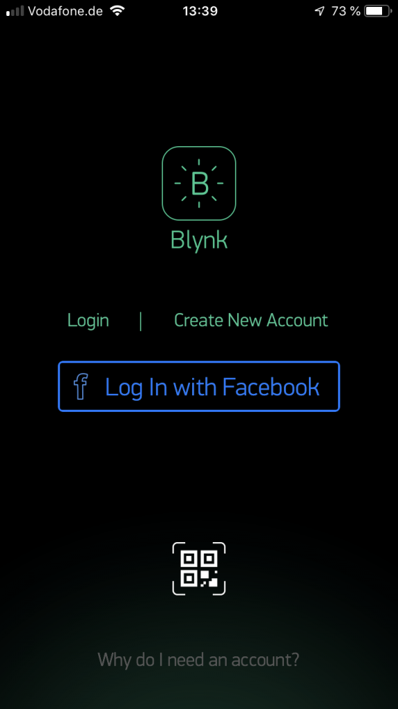
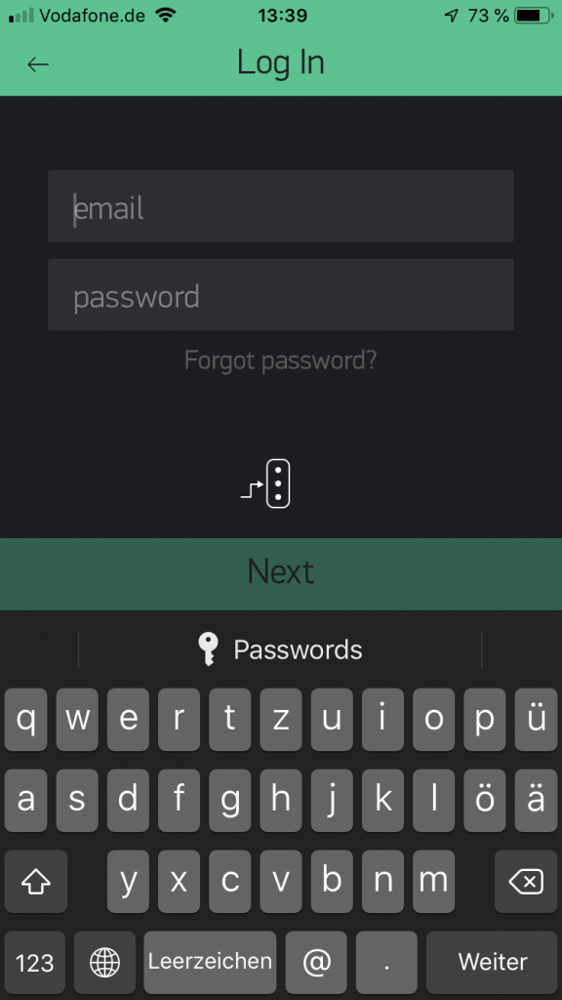
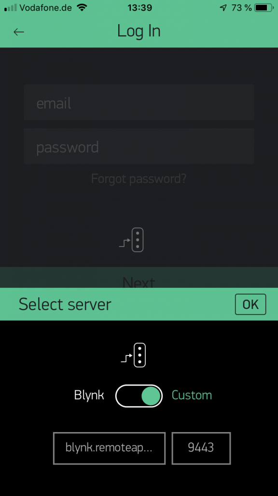
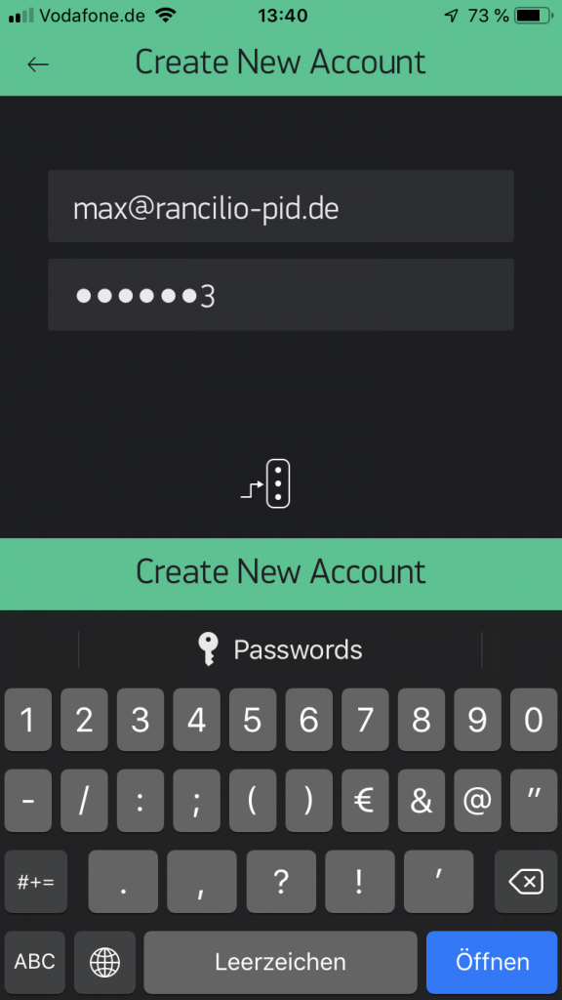
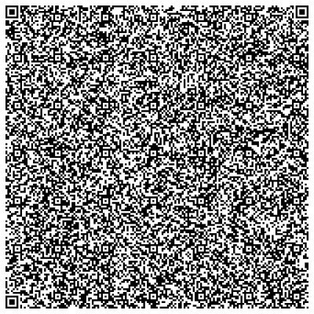
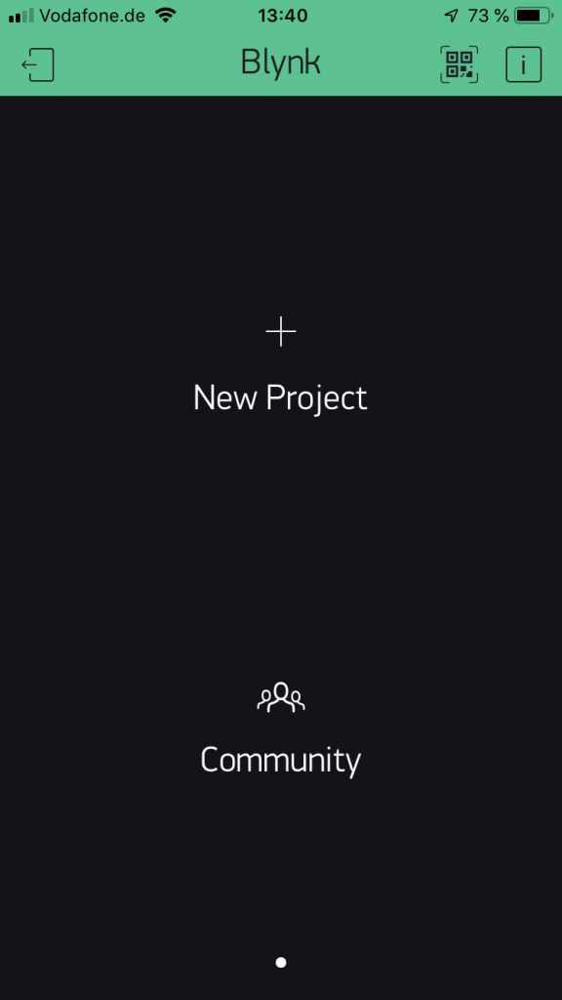
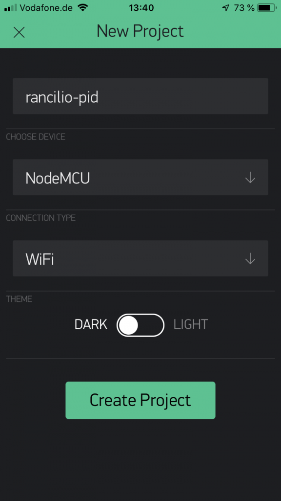
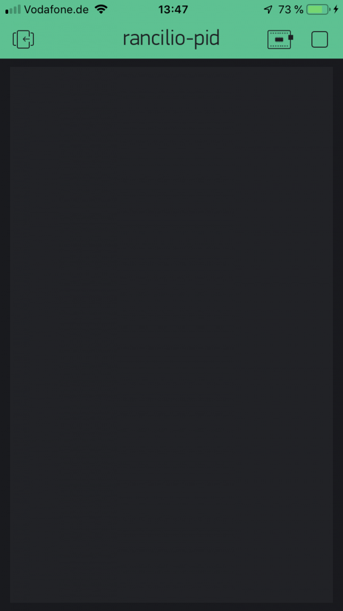
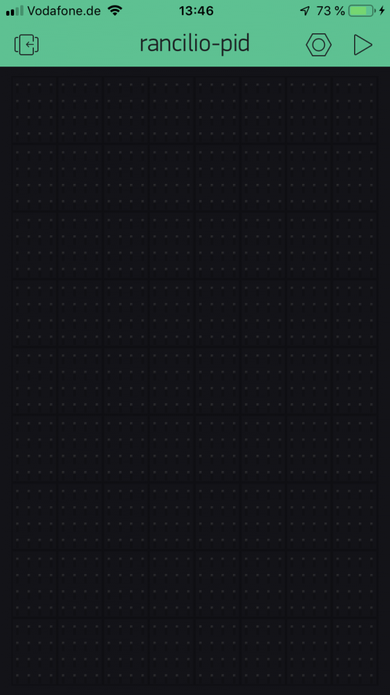
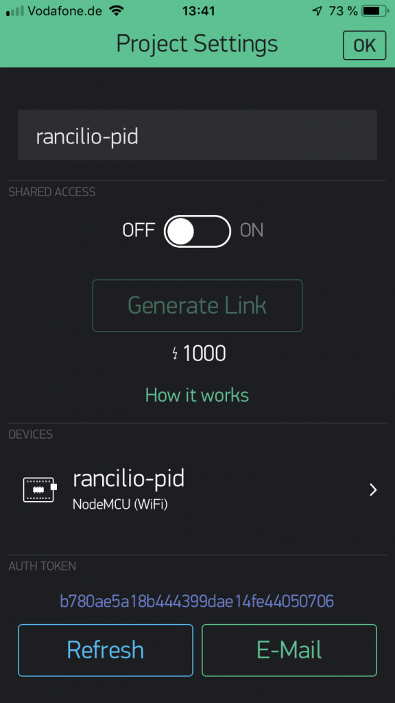

# Einrichtung von Blynk
{: .no_toc }

Contents

* TOC
{:toc}

## Introduction

The next step is to set up the Blynk app on your phone to be able to control the PID parameters. Blynk is a cloud service which makes NodeMCU controllable from your phone or tablet. We have our own Blynk server available which is hosted by Markus. You can of course also use the public Blynk server but probably have to deal with additonal costs for setup etc.

The principle workflow is as follows:

The PID in your machine sends data to the Blynk server where the app can access it as well. Communication is in both directions, meaning the Blynk server not only receives data from the PID for visualization purposes etc. but also provides configuration data to the PID. To make sure only you can access your machine, an Auth token is used.

Markus has a video on Youtube which explains the installation procedure

## Video: Installation and setup of Blynk app

## Step 1: Download and install app

from the app store on your phone

## Step 2: create account

Open the Blynk app and click „Create New Account“

click on the traffic-light symbol to change the server!
Otherwise you will use the "normal" Blynk server

**Important**:

Switch to „Custom“.
Server address: blynk.remoteapp.de
Port: 9443
confirm with „OK“

add your email address and click next

Your account has now been created
Create your first project by clicking "New Project"

Here, you can also direcly press the "scan" symbol an scan the following QR code:

QR-Code for Android:

QR-Code for IOS:

(shown PID values are not up to date!)

or create the app yourself.

Give the project a meaningful name, choose "NodeMCU" as device

To read the AuthKey (will be needed in Arduino IDE), press the square in the upper right corner

Now, press the "nuts" symbol

The AUth code is shown in the lower part of the screen, it is basically the key for encrypting the communication between NodeMCU, the server and your phone and should be kept sectet. You can also email it to yourself.

## Step 3: integrate Auth token into program code

The Authkey will be written into userConfig.h in the variable AUTH, SSID and PASS will be the name and password for your Wifi network. More on that in Part 2
